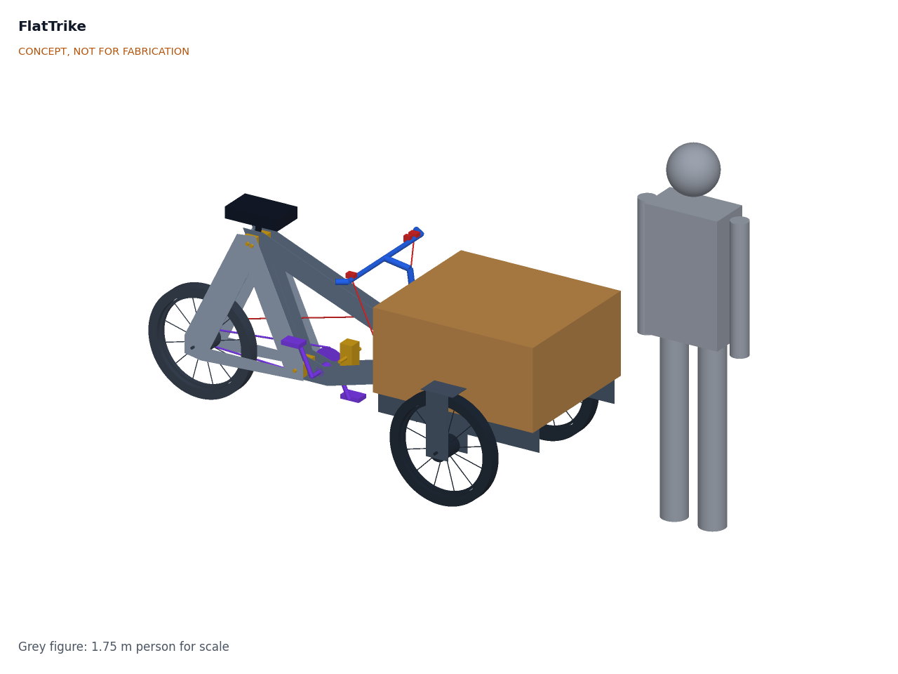

# FlatTrike

  

**Area:** Mobility and Logistics · **TRL:** 2 of 9 (concept formulated) · **Prototype budget:** about $800 USD · **Difficulty:** 3 of 5

Bolt-together cargo tricycle whose frame is cut from flat sheet steel by any laser or waterjet shop, uses standard bicycle parts, and ships flat.

[Interactive 3D model](media/viewer.html) · [Concept blueprint (PDF)](media/concept-blueprint.pdf) · [Review note](docs/REVIEW.md)

## Problem

Street vendors and micro-logistics operators in emerging markets need durable cargo tricycles, but imported units are expensive and hard to repair.

## Concept

Bolt-together cargo tricycle whose frame is cut from flat sheet steel by any laser or waterjet shop, uses standard bicycle parts, and ships flat. The concept is a front loader: two 20 in front wheels carry a lockable plywood box on a steel bed that pivots on one kingpin, and the rider sits over a standard 20 in rear wheel with a 3-speed drum brake hub. It is sized for 150 kg of cargo and an 80 kg rider (about 300 kg gross), and the pedal-only prototype costs about $640 in parts. Layout, steering and the electric assist option are proposed, awaiting Amish.

Full design precis: [docs/02-concept.md](docs/02-concept.md)

## Key components

- Laser-cut 3 mm steel plates: spine, rear stays and front bed, estimated to nest on one standard sheet
- Tab-and-slot ribs and spacers with M8 bolts and locknuts (no welding)
- Kingpin with a standard 1 1/8 in headset (box steering)
- 20 in wheels (3) with drum brakes; 3-speed hub at the rear
- Standard bicycle drivetrain, seat and handlebar
- Lockable plywood cargo box with a counter lid
- Optional electric assist kit (proposed, not in the base cost)

The working bill of materials is in [bom/bom.csv](bom/bom.csv).

## Safety

> **Safety:** The frame's strength and fatigue life are unverified. Frames must be load-tested to twice the rated payload before use on public roads. Cut plate edges must be deburred, and the empty trike can tip in brisk turns. See the safety section of the [design precis](docs/02-concept.md).

## Repository layout

| Folder | Contents |
| --- | --- |
| `docs/` | Problem, concept, requirements, calculations and design decisions |
| `cad/src/` | build123d Python source, the source of truth for all geometry |
| `cad/step/`, `cad/stl/` | Exported models for FreeCAD, other CAD tools and printing |
| `cad/drawings/` | 2D sketches and dimensioned drawings |
| `bom/` | Bill of materials |
| `electronics/` | KiCad schematics and PCB layouts |
| `firmware/` | Microcontroller code |
| `media/` | Renders, perspectives and photos |
| `build-log/` | Dated prototyping notes |

## Documentation

Controlled documents follow the portfolio [documentation standard](.kit/STANDARDS.md). Each carries a document ID (FTK-PRC-001 for the precis), a version and a revision history. Branded PDFs are built with `python .kit/render.py` and attached to GitHub Releases when a document is tagged, for example `FTK-PRC-001/v1.0`.

## Licenses

- **Hardware** (CAD, drawings, BOM, electronics): [CERN-OHL-S v2](LICENSE)
- **Software** (firmware, scripts, notebooks): [MIT](LICENSE-SOFTWARE)

Part of the open hardware portfolio at [amishchadha.com](https://amishchadha.com).
