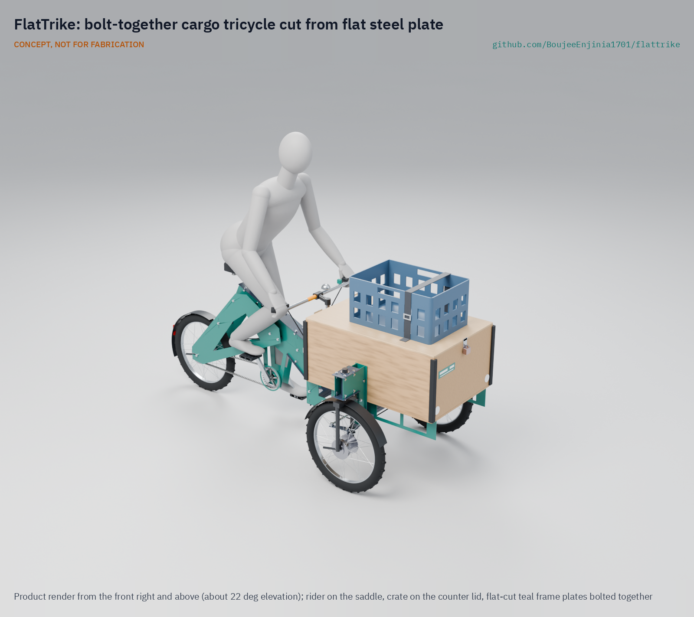
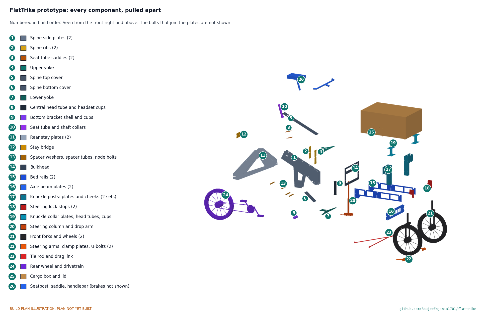

# FlatTrike

     

**Area:** Mobility and Logistics · **TRL:** 3 of 9 (proof of concept on paper) · **Value-engineering target:** about $800 USD (estimated parts cost $728) · **Difficulty:** 3 of 5

Bolt-together cargo tricycle whose frame is cut from flat sheet steel by any laser or waterjet shop, uses standard bicycle parts, and ships flat.

[Exploded render](media/render-exploded.png) · [Detail render](media/render-detail.png) · [Interactive 3D model](media/viewer.html) · [Concept blueprint (PDF)](media/concept-blueprint.pdf) · [General arrangement (PDF)](cad/drawings/FTK-DWG-001.pdf) · [Sizing note](docs/04-calcs/01-sizing.md) · [Prototype build plan](docs/05-build-plan.md) · [Design decisions](docs/06-design-decisions.md) · [Review note](docs/REVIEW.md)

## Concept rationale

Cargo tricycles fail their owners in two ways: cheap workshop builds flex, crack and weigh too much, and good imported ones cost too much to buy or repair. Precision is what separates them, and in a tubular frame precision comes from jigs and skilled welding. FlatTrike moves that precision into the cutting file. Every steel part is a flat 3 mm plate that any laser or waterjet shop can cut from open DXF files, tabs and slots make the plates locate one another, and bolts with all-metal locknuts replace welds. The moving parts (wheels, drum hubs, forks, headsets, chain and cranks) are standard bicycle parts sold in regional markets.

Keeping the design open and garage-buildable is the point, not a side effect. A frame that anyone can re-cut is a frame that a vendor in Pune or Nairobi can repair one plate at a time, at a local shop, without waiting for a proprietary spare. A prototype for about $800 in parts lets a cooperative, a university workshop or a single mechanic build and test one before anyone commits to a batch.

## Burning platform

About two billion people, more than 61 % of the world's employed population, work in the informal economy, rising to 85.8 % of employment in Africa ([ILO, 2018](https://www.ilo.org/resource/news/more-60-cent-world%E2%80%99s-employed-population-are-informal-economy)). Street vending and small-scale carrying are a large part of that work, and they run on human-powered vehicles. In India alone, the government's PM SVANidhi microcredit scheme had lent to more than 68 lakh (6.8 million) street vendors by July 2025 and is being extended to 2030 ([Press Information Bureau, 2025](https://www.pib.gov.in/PressReleasePage.aspx?PRID=2161157&reg=48&lang=2)).

The vehicles these workers use have barely changed. ITDP found that the traditional Indian cycle rickshaw weighs about 80 kg, has a single high gear, and has a wooden passenger structure that must be replaced every two to three years ([ITDP, 2006](https://itdp.org/2006/07/01/rickshaws-in-the-new-millennium/)). Every extra kilogram and every repair comes out of an income measured in trips per day, so a lighter, longer-lived and locally repairable cargo trike is worth more to these users than almost any other tool.

## Where it could be used

### By industry

| Industry | Use |
| --- | --- |
| Street vending and food retail | Mobile stall with a lockable box whose lid is a counter |
| Last-mile parcel and grocery delivery | Pedal or assisted delivery in dense districts and narrow lanes |
| Recycling and waste collection | Door-to-door collection of recyclables by informal and cooperative pickers |
| Water and gas cylinder distribution | Short, heavy delivery rounds from depot to households and shops |
| Agriculture and markets | Moving produce from farm gate or wholesale market to retail pitches |
| Municipal and campus services | Park, street-cleaning and maintenance crews carrying tools and supplies |

### By country or region

| Country or region | Why it matters there |
| --- | --- |
| India | More than 6.8 million street vendors have borrowed under PM SVANidhi ([PIB, 2025](https://www.pib.gov.in/PressReleasePage.aspx?PRID=2161157&reg=48&lang=2)); loading rickshaws and *thelas* are everywhere, and laser shops are common in industrial estates |
| Sub-Saharan Africa (for example Kenya and Nigeria) | 85.8 % of employment in Africa is informal ([ILO, 2018](https://www.ilo.org/resource/news/more-60-cent-world%E2%80%99s-employed-population-are-informal-economy)); goods move by handcart and bicycle on rough roads, where local repair matters most |
| Southeast and South Asia (for example Bangladesh and Indonesia) | 68.2 % of employment in Asia and the Pacific is informal ([ILO, 2018](https://www.ilo.org/resource/news/more-60-cent-world%E2%80%99s-employed-population-are-informal-economy)); cycle rickshaws and vending tricycles are a mainstay of city trade |
| The Americas (for example Mexico and Peru) | 40.0 % of employment in the Americas is informal ([ILO, 2018](https://www.ilo.org/resource/news/more-60-cent-world%E2%80%99s-employed-population-are-informal-economy)); a frame cut from open files suits small vendors and cooperatives in that informal economy |
| United States (New York City) | The city ran a commercial cargo bicycle pilot with delivery firms and published an evaluation ([NYC DOT](https://www.nyc.gov/html/dot/downloads/pdf/commercial-cargo-bicycle-pilot-evaluation-report.pdf)); an open, repairable frame suits small operators and community delivery schemes |

## What sparked the idea

The starting point was the OX, a flat-pack truck that Gordon Murray, the designer behind McLaren's road cars, developed for the Global Vehicle Trust, which the British philanthropist Torquil Norman founded to develop cost-effective transport for the developing world. TechCrunch reported in 2016 that six OX trucks pack into one shipping crate in flat-pack form and that a trained team of three can unpack and assemble one in about 12 hours ([TechCrunch, 2016](https://techcrunch.com/?p=1393387)). FlatTrike takes the same idea one scale down and one step further: instead of shipping a factory kit, it ships the files, so the flat parts can be cut in the city where the trike will work and re-cut there when one breaks.

## Problem

Street vendors and micro-logistics operators in emerging markets need durable cargo tricycles, but imported units are expensive and hard to repair, and cheap local workshop tricycles are heavy, flexible and short-lived.

## Concept

Bolt-together cargo tricycle whose frame is cut from flat sheet steel by any laser or waterjet shop, uses standard bicycle parts, and ships flat. The concept is a front loader: two 20 in front wheels, each steering in a standard bicycle fork linked by a tie rod (Ackermann steering), carry a fixed, lockable plywood box, and the rider sits over a standard 20 in rear wheel with a 3-speed drum brake hub. It is rated for 148 kg of cargo with a rider up to 80 kg, or 138 kg with a rider up to 90 kg, weighs 71.7 kg empty, turns in 5.64 m with a lock stop at each front wheel, and the pedal-only prototype costs $728 in parts. The TRL 3 calculations (FTK-CAL-001) show that unassisted hill climbing is not yet met, the production cost estimate (about $466) is over its $300 value-engineering target, and that making the design buildable added mass, so the cargo rating was trimmed by 2 kg to stay inside the 300 kg class (decided 2026-10-02); see the [design decisions register](docs/06-design-decisions.md) and the [review note](docs/REVIEW.md).

Full design precis: [docs/02-concept.md](docs/02-concept.md)

## Key components

- 37 laser-cut 3 mm steel plates: closed-box spine, rear stays, front bed, two knuckle posts and their steering lock stops, nested on one standard sheet
- Tab-and-slot joints and cut spacer washers with 97 M8 class 8.8 bolts and all-metal locknuts held in windows in the plates (no welding)
- Ackermann steering: central steering column in a 200 mm head tube, two 20 in forks on their own 1 1/8 in headsets, tie rod and drag link
- 20 in wheels (3) with drum brakes; 3-speed hub at the rear
- Standard bicycle drivetrain, seat and handlebar
- Lockable plywood cargo box with a counter lid
- Optional electric assist on a SwapCell pack (route C; not in the prototype budget)

The working bill of materials is in [bom/bom.csv](bom/bom.csv).

## Building the prototype

The [prototype build plan](docs/05-build-plan.md) (FTK-BLD-001) shows, in pictures, how to make each of the 26 groups of parts and put them together in 21 steps; nothing has been built yet. Every frame part is a 3 mm plate cut by a laser or waterjet shop, joined by tabs in slots and M8 bolts whose locknuts sit in windows in the plates; the rest is bought bicycle parts, a cut-down fork for the steering column, three tube lengths and a plywood box. Writing the plan made the design buildable: the joints, stay bolts, dropouts, head tube clamping, steering linkage, steering arms and knuckle posts were redesigned (FTK-DDR-003, open for Amish's review), and the open decisions this raised are in the [design decisions register](docs/06-design-decisions.md). Every picture is drawn from the model, which checks that no two parts overlap, every part is fixed, and the steering turns lock to lock without touching the frame.

## Safety

> **Safety:** The frame's strength and fatigue life are unverified. Frames must be load-tested to twice the rated payload before use on public roads. Cut plate edges must be deburred, and the empty trike can tip in brisk turns, so riders must keep to 6 km/h in full-lock turns when empty. See the safety section of the [design precis](docs/02-concept.md).

## Repository layout

| Folder | Contents |
| --- | --- |
| `docs/` | Problem, concept, requirements, calculations, prototype build plan and design decisions |
| `cad/src/` | build123d Python source, the source of truth for all geometry |
| `cad/step/`, `cad/stl/` | Exported models for FreeCAD, other CAD tools and printing |
| `cad/drawings/` | 2D sketches and dimensioned drawings |
| `bom/` | Bill of materials |
| `electronics/` | KiCad schematics and PCB layouts |
| `firmware/` | Microcontroller code |
| `media/` | Renders, perspectives and photos |
| `build-log/` | Dated prototyping notes |

## Documentation

Controlled documents follow the portfolio [documentation standard](.kit/STANDARDS.md). Each carries a document ID (FTK-PRC-001 for the precis), a version and a revision history. Branded PDFs are built with `python .kit/render.py` and attached to GitHub Releases when a document is tagged, for example `FTK-PRC-001/v1.0`.

## Credits

Designed by Amish Chadha. See [CONTRIBUTORS.md](CONTRIBUTORS.md) for roles. To cite this design, use [CITATION.cff](CITATION.cff) (GitHub shows it as "Cite this repository").

AI assistance (Claude) was used to accelerate concept renders, prototype documentation and first-pass sizing calculations. Design direction and all decisions are Amish Chadha's, recorded in this repository's decision records (`docs/decisions/`).

## Licenses

- **Hardware** (CAD, drawings, BOM, electronics): [CERN-OHL-S v2](LICENSE)
- **Software** (firmware, scripts, notebooks): [MIT](LICENSE-SOFTWARE)

A project of the [Design Molecule](https://designmolecule.com) lab.
