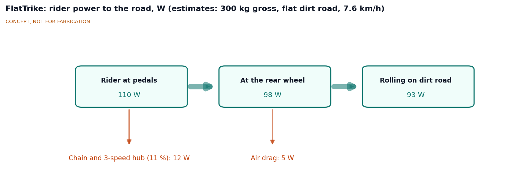
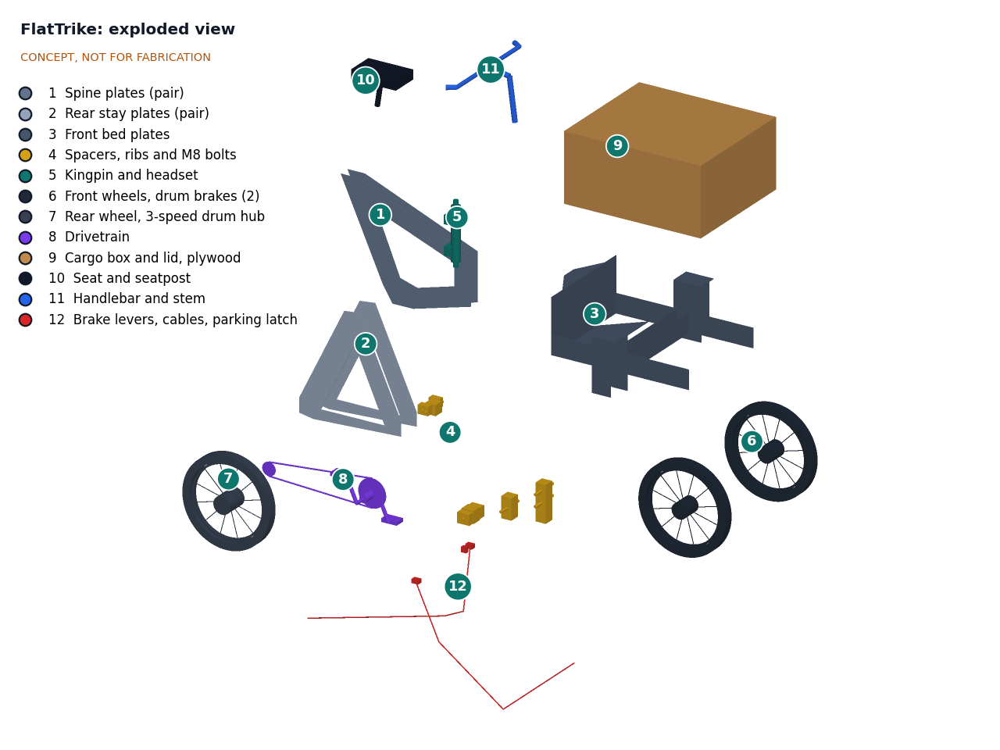

# FlatTrike design precis

FlatTrike is a front-loading cargo tricycle whose whole steel structure is a kit of flat 3 mm plates, cut by any laser or waterjet shop from open files and bolted together through tabs, slots and spacers with no welding or bending. Two 20 in front wheels carry a lockable plywood cargo box on a steel bed that pivots about a single kingpin (box steering), and the rider sits over a standard 20 in rear wheel with a 3-speed drum brake hub. First-order numbers suggest the trike carries 150 kg of cargo and an 80 kg rider at about 300 kg gross, cruises at about 7.6 km/h on the flat on 110 W of rider power, costs about $640 in prototype parts against the $800 budget, and packs flat into about 0.36 m³. It also shows three shortfalls to resolve at TRL 3: the empty mass is about 68 kg against a 55 kg target, the empty trike tips at about 0.18 g in a turn, and a loaded 5 % hill needs roughly twice what a rider can sustain.

*Figure 1. FlatTrike massing model with a 1.75 m person for scale. Every grey and dark steel part is a flat plate; wheels, drivetrain, seat and bars are standard bicycle parts.*

## How it works

1. **Cut.** A laser or waterjet shop cuts about 20 plates from one 1,250 x 2,500 x 3 mm mild steel sheet using open DXF files (to be produced at TRL 3). Tabs, slots and bolt holes are cut in the same pass, so hole positions are as accurate as the cutter, typically a few tenths of a millimeter.
2. **Assemble.** The two spine plates (item 1) are joined by slotted ribs and M8 bolts (item 4) into a twin-plate box beam that runs from the seat node down to the bottom bracket and forward to the kingpin. The rear stay plates (item 2) bolt to the outside of the spine through spacers and carry the rear dropouts. The front bed (item 3) is a second bolted assembly: two yoke plates around the kingpin, a bulkhead, two side rails, a twin-plate axle beam and a pair of fork plates around each front wheel. No jig is needed because the plates locate one another.
3. **Steer.** The whole front bed, with both front wheels and the box, pivots on a standard 1 1/8 in headset inside a short head tube (item 5) clamped to the front of the spine. The rider steers with a handlebar (item 11) fixed to the bed's bulkhead. This is the box-steering layout used by many front-loading tricycles.
4. **Ride.** A standard bottom bracket and cranks (item 8) drive the 20 in rear wheel (item 7) through a chain and a 3-speed hub with a built-in drum brake. The chain runs in the gap between the right spine plate and the right stay plate.
5. **Stop and park.** Drum brakes in all three hubs (items 6 and 7) are sealed from rain and dust. A lever lock (item 12) holds the brakes on when the trike is parked on a slope.
6. **Sell.** The 12 mm plywood box (item 9) holds about 190 L, locks, and has a hinged lid at about 0.79 m that doubles as a counter.

*Figure 2. Where 110 W of rider power goes at 300 kg gross on a flat dirt road. All values are estimates.*

## Main components

Numbers match the exploded view (Figure 3) and `bom/bom.csv`.

Table 1. Main components.

| # | Component | Proposed choice | Notes |
| --- | --- | --- | --- |
| 1 | Spine plates (pair) | 3 mm mild steel, about 755 x 630 mm each with a lightening window, 60 mm apart | Main structural beam from seat to kingpin |
| 2 | Rear stay plates (pair) | 3 mm mild steel triangles carrying the rear dropouts, 140 mm apart | Bolt to the spine through spacers at the seat node and the bottom bracket |
| 3 | Front bed plates | Lower and upper yoke plates, bulkhead, two side rails, twin-plate axle beam, four wheel fork plates and two bridge plates, all 3 mm | Carries the box, both front wheels and the handlebar; pivots as one unit |
| 4 | Spacers, ribs and M8 bolts | Slotted rib plates between the spine plates; spacer stacks between spine and stays; about 100 M8 class 8.8 bolts with locknuts | Rib count and bolt pattern set at TRL 3 |
| 5 | Kingpin and headset | Standard 1 1/8 in threaded headset in a short steel head tube clamped between spine clamp plates; steerer bolted to the yoke plates | One of two parts that are not flat plate (see design choices) |
| 6 | Front wheels (2) | 20 x 2.125 in (ISO 406), 36-hole rims, 90 mm class drum brake hubs | Axles clamp between the fork plates |
| 7 | Rear wheel | 20 x 2.125 in with a 3-speed hub and built-in drum brake | Standard bicycle rear wheel in plate dropouts |
| 8 | Drivetrain | Bottom bracket in a clamped shell, 170 mm cranks, 32-tooth chainring, 1/8 in chain, sprocket to suit a low gear | Chain line in the gap between spine and stay |
| 9 | Cargo box and lid | 9 to 12 mm exterior plywood, about 800 x 700 x 380 mm, hinged lockable lid | Bolts to the bed rails and bulkhead; replaceable by a carpenter |
| 10 | Seat and seatpost | Sprung saddle on a 27.2 mm post in a clamp block at the spine's seat node | Height adjustable |
| 11 | Handlebar and stem | Steel riser bar on a stem bolted to the bulkhead | Fixed to the steering bed |
| 12 | Brake levers, cables and parking latch | Two levers (front pair through a cable splitter, rear drum), lever lock for parking | Rear cable routed along the spine through the kingpin area |

Paint, fasteners for the box, mudguards, reflectors and a bell are in the BOM but not modelled. An optional electric assist kit is listed but excluded from the base cost.

*Figure 3. Exploded view with numbered callouts matching the BOM.*

## First-order numbers

All values are estimates for concept review and will be checked at TRL 3. The design load case is an 80 kg rider and 150 kg of cargo on the trike, on a flat dry road unless stated.

### Size and mass

Table 2. Size and mass estimates.

| Quantity | Estimate | Basis | Requirement |
| --- | --- | --- | --- |
| Overall length, width, height | about 2.11 x 0.96 x 0.94 m | Massing model bounding box (saddle top) | R9 met |
| Wheelbase, front track | 1.45 m, 0.80 m | Model | |
| Steel plate area | about 1.5 m² | Model: spine 0.33, stays 0.32, front bed 0.84 m² | R4: nests on a 3.1 m² sheet |
| Steel plate mass | about 35 kg solid, about 30 kg with lightening holes | 23.6 kg/m² for 3 mm steel | |
| Other parts | about 38 kg | Box 16, wheels 9, drivetrain 3, spacers and bolts 3, seat, bars, brakes, kingpin and accessories about 7 | |
| **Empty mass** | **about 68 kg** | Sum, rounded | **R8 (55 kg) not met** |
| Gross mass, design case | about 298 kg | 68 + 80 + 150 | R1 met with no margin |
| Box volume | about 190 L | 776 x 676 x 368 mm inside | R17 met |
| Flat-pack volume | about 0.36 m³ | Plates and box panels stacked about 1.0 x 0.8 x 0.15 m; three wheels 0.51 m in diameter stacked beside | R6 met |

The empty mass is the concept's weakest number. The 3 mm plates are about 44 % of it and the plywood box about 24 %. Options for TRL 3 are 2 mm plate for lightly loaded parts (fork bridges, yokes, stays), larger lightening windows where stresses are low, and a 9 mm box. Each is a trade against stiffness and durability, which are the reasons users would pick FlatTrike over a workshop tricycle.

### Riding power and hills

Assumptions: rolling resistance coefficient 0.015, drag area 0.9 m², air density 1.2 kg/m³, gross mass 300 kg, drivetrain efficiency 89 %, rider sustaining 110 W at the pedals.

Table 3. Riding power estimates.

| Quantity | Estimate | Basis | Requirement |
| --- | --- | --- | --- |
| Rolling resistance | about 44 N | 0.015 x 300 kg x 9.81 m/s² | |
| Power at the rear wheel | about 98 W | 110 W x 0.89 | |
| **Cruise speed, flat** | **about 7.6 km/h** | 98 W = 44 N x v + 0.54 v³ | R12 (7 km/h) met |
| Split at 7.6 km/h | about 93 W rolling, 5 W drag | | Figure 2 |
| Force on a 5 % grade | about 191 N | 300 x 9.81 x (0.05 + 0.015) | |
| Power at 4 km/h on 5 % | about 212 W at the wheel, about 240 W at the pedals | 191 N x 1.11 m/s | **R13 not met unassisted** |
| Wheel torque on 5 % | about 49 N·m | 191 N x 0.254 m | |
| With a 250 W mid-drive assist | about 250 W motor plus 110 W rider, about 320 W at the wheel, about 6 km/h on 5 % | | R13 met with the option |

A loaded rider can creep up a 5 % grade in the lowest gear for a short distance, but not sustain it; most will push. This matches the ITDP finding that single-speed rickshaw riders dismount on inclines. The 3-speed hub helps but does not close the gap, which is the case for offering an electric assist option.

### Stability

The tipping axis of a two-front-wheel tricycle runs from the outer front tyre contact to the rear tyre contact. The tipping threshold is the lateral acceleration, in g, equal to the distance from the center of mass to that axis divided by the height of the center of mass.

Assumptions: seated rider center of mass at 0.30 m ahead of the rear axle and 1.10 m high; cargo at the box center, 1.46 m ahead and 0.60 m high; trike center of mass 0.85 m ahead and 0.45 m high; half track 0.40 m.

Table 4. Stability estimates.

| Case | Center of mass (ahead of rear axle, height) | Tipping threshold | Speed on a 5 m turning radius at the threshold | Requirement |
| --- | --- | --- | --- | --- |
| Loaded (300 kg) | about 1.01 m, 0.70 m | about 0.38 g | about 15 km/h | R10 met |
| Rider only (148 kg) | about 0.55 m, 0.80 m | about 0.18 g | about 11 km/h | **R10 not met** |

The empty trike carries most of its weight on the single rear wheel, so it tips at modest cornering speeds. Box steering makes this worse: as the bed pivots, the outer front wheel moves inward and the tipping axis moves toward the center of mass. Options for TRL 3 are a wider track (1.0 m raises the empty threshold to about 0.23 g but breaks R9), moving the seat forward and lower, Ackermann steering so the track stays constant, and rider guidance on cornering speed.

### Structure

Assumptions: 3 mm S235 plate (yield about 235 MPa), dynamic factor 2.5 on the rated cargo for potholes and curbs.

Table 5. First-order structural estimates.

| Quantity | Estimate | Basis |
| --- | --- | --- |
| Front axle beam bending | about 26 MPa | 3.7 kN spread across an 800 mm simply supported span; twin 3 x 120 mm plates, section modulus about 14,400 mm³ |
| Spine bending under the rider | about 20 MPa | 2.0 kN at the seat between the rear axle and the kingpin; twin 3 x 140 mm plates |
| Kingpin vertical load | about 1 kN | Share of rider and frame weight carried forward, times 2.5 |

Bending stresses in the plates are low. The governing questions are the ones ITDP found in the traditional rickshaw: stiffness and alignment at the bolted joints, and fatigue. Thin plates are weak in side bending and twist unless the ribs and spacers make the twin plates act as a closed box; bolts in clearance holes can slip; and fatigue cracks start at hole edges and cut corners. These checks, with the EN 17860 load cases, are the core of TRL 3 (R2).

### Braking

At 15 km/h the loaded trike carries about 2.6 kJ of kinetic energy. Stopping in 6 m needs about 1.5 m/s², which three 90 mm class drum brakes should give. The risk is a long descent: holding 10 km/h down a 5 % grade puts about 0.4 kW continuously into the drums, which can fade them.

### Cost

Table 6. Cost summary (indicative, from `bom/bom.csv`).

| Group | Indicative cost | Requirement |
| --- | --- | --- |
| Steel plates, spacers, bolts and kingpin (items 1 to 5) | about $223 | |
| Wheels, drivetrain, seat, bars and brakes (items 6 to 8, 10 to 12) | about $295 | |
| Cargo box (item 9) | about $60 | |
| Paint and accessories (not modelled) | about $60 | |
| **Base prototype, pedal only** | **about $640** | R15 ($800) met |
| Optional electric assist kit | about $400 | With it, about $1,040; R15 not met |

Laser cutting is priced at small-batch job-shop rates. At volume the plates would cost much less, but a production cost target has not been set (see open questions).

## Key design choices

Every choice below is **Proposed, awaiting Amish**.

- **Layout.** Options: (A) tadpole front loader with the cargo ahead of the rider, as modelled; (B) delta rear loader with the cargo behind the rider, the common *thela* layout, which keeps a standard bicycle fork but needs a live rear axle, one-wheel drive and bearings that are not standard bicycle parts; (C) delta front loader with a fork behind the box. Recommendation: A, because the rear end stays a standard bicycle rear wheel with gears and a drum brake, and vendors can see and serve from the box. Proposed, awaiting Amish.
- **Steering.** Options: (A) box steering on one kingpin, as modelled: fewest parts and all flat plate plus one headset, but heavy steering when loaded, a narrowing track in turns and kickback from potholes; (B) Ackermann steering with two stub kingpins and a tie rod, with the box fixed to the frame: better stability and lighter steering, but more precise parts and about $40 more. Recommendation: A for the first prototype, with B assessed at TRL 3 because of the stability shortfall. Proposed, awaiting Amish.
- **Joints.** Flat plates located by tabs and slots and clamped with M8 class 8.8 bolts. Options for the nut: nylon-insert locknuts (cheap and common, but weaken with heat and reuse) or all-metal prevailing-torque nuts. Recommendation: all-metal locknuts on structural joints. Proposed, awaiting Amish.
- **Plate material.** 3 mm S235JR or ASTM A36 class hot-rolled steel, stocked by nearly every laser shop, versus S355 (stronger, allows thinner plate but less common) or stainless (no painting, about 4 times the price). Recommendation: 3 mm S235 or A36 with primer and paint or powder coat. Proposed, awaiting Amish.
- **Head tube and bottom bracket housings.** These are the two parts a flat plate cannot replace, because bearings need a round bore. Options: (A) buy a standard steel head tube section and bottom bracket shell and clamp each between plates with bolted saddle plates, as modelled; (B) bolt-in bearing housings (pillow-block style) for the bottom bracket; (C) salvage the head tube and bottom bracket from a donor bicycle frame. Recommendation: A, with the clamp design and its alignment tolerance checked at TRL 3. Proposed, awaiting Amish.
- **Wheels and brakes.** 20 in wheels on all three positions for common spares and a low load floor, with drum brake hubs throughout. Recommendation as modelled. Proposed, awaiting Amish.
- **Electric assist.** The scaffold listed an optional hub motor kit. A drum-brake 3-speed rear hub cannot also be a hub motor, so the practical options are: (A) no assist in the base design, with the bottom bracket housing sized to accept a mid-drive later; (B) a generic 36 V, 250 W mid-drive kit with its own pack (about $400); (C) a 48 V mid-drive powered by a SwapCell pack, sharing packs and docks with the rest of the portfolio (kit about $260 plus a SwapCell pack of about $370). Recommendation: A for the prototype budget, with C as the preferred assist route because of R13 and portfolio consistency. Proposed, awaiting Amish.
- **Budget.** The pedal-only base at about $640 fits the $800 budget; `project.yaml` is unchanged. Adding assist would exceed it. Proposed, awaiting Amish.

## Safety

> **Safety:** FlatTrike is a loaded vehicle of about 300 kg that shares the road with traffic, built from cut steel plate and exposed moving parts. Treat structural failure, tipping, braking, cut edges and pinch points as hazards at every stage.

- **Structural failure.** A bolted joint that loosens or a plate that cracks at a hole can let the front bed or seat collapse under load. Structural bolts need locknuts, a set torque and a check at every service. The frame must not be used on public roads until its strength and fatigue life are verified (R2), and overloading well beyond the rating is common in this use, so the margin must allow for it.
- **Tipping.** The empty trike tips at about 0.18 g, a brisk turn at about 11 km/h. Riders must slow for turns, especially empty, and keep heavy cargo low in the box. Box steering reduces stability further at full lock.
- **Braking and descents.** Drum brakes fade on long descents at gross mass. Riders should descend slowly and in stages. The parking latch must hold the loaded trike on a slope, because a runaway trike in a market is a serious hazard.
- **Sharp edges.** Laser- and waterjet-cut edges and corners can be sharp and burred. Every plate must be deburred and every exposed corner radiused before painting; protect hands during assembly.
- **Moving parts and pinch points.** The chain, chainring and spokes can catch clothing and fingers; fit a chain guard. The steering bed swings about the kingpin close to the rider's feet and the frame; keep hands and feet clear of the gap between the bed and the spine.
- **Traffic visibility.** A slow, wide vehicle in mixed traffic needs reflectors, a bell and, for dusk use, lights.
- **Coatings.** Priming, painting and powder coating involve solvents and fine particles; use ventilation and masks.
- **Electric assist (option only).** If the assist option is chosen, its lithium-ion pack needs a BMS, a fused output and safe charging practice, as set out in the SwapCell design.

## Open questions for TRL 3

- Confirm layout and steering (front loader with box steering or Ackermann) with Amish and the partner.
- Model the bolted plate frame for stiffness and fatigue under EN 17860 load cases; decide rib count, bolt pattern and whether plates need folded flanges after all.
- Close the mass gap (R8) and the empty-stability gap (R10), or propose revised targets.
- Design the head tube and bottom bracket clamps and set their alignment tolerance.
- Check the chain line and crank Q-factor with the twin-plate spine.
- Nest all plates on one sheet and get quotes from laser shops in the target city.
- Set a production cost target against local workshop tricycles at ₹10,000 to ₹25,000.
- Decide on the electric assist option and, if chosen, whether it uses SwapCell.

Concept media: [blueprint sheet](../media/concept-blueprint.pdf), [interactive 3D model](../media/viewer.html).
