# FlatTrike prototype build plan

**Plan, not yet built.** How to build the first proof-of-concept prototype, component by component. Building and testing to it is TRL 4 work. Decisions still to be made are kept in the design decisions register ([docs/06-design-decisions.md](06-design-decisions.md)), not here.

## 1. What you are building

*Figure 1. Every component pulled apart and numbered in build order. The bolts that join the plates are left out of this picture.*

The prototype is a front-loading cargo tricycle: a steel frame of 35 flat plates, cut from one 1,250 x 2,500 x 3 mm sheet of mild steel by a laser or waterjet shop, carrying a plywood box over two steered 20 in front wheels, with the rider over a 20 in rear wheel with a 3-speed hub. Figure 1 shows the 25 groups of parts in the order you make or fit them. The plates join by tabs that sit in slots, held closed by M8 bolts whose locknuts sit in windows cut in the plates; nothing is welded or bent. The other made parts are 78 spacer washers cut from the same sheet, four spacer tubes and three tube lengths sawn from bought steel tube, a bought fork cut down for the steering column, and a plywood box made by a carpenter. Everything else is bought bicycle parts: wheels, forks, headsets, bottom bracket, drivetrain, brakes, seatpost, saddle and bars. The work is deburring cut plate, sawing and facing tube, drilling a fork crown and the box, pressing headset cups, and ordinary bicycle mechanics. The parts cost about $724, from the bill of materials, against a value-engineering target of $800.

> **Safety:** The finished trike is a vehicle of about 300 kg loaded with exposed moving parts. Laser-cut edges are sharp: deburr every plate and wear cut-resistant gloves when handling them. Keep fingers clear of the steering linkage, wheels and chain whenever the trike is moved. Do not ride it, load it or let anyone else use it until the safety stops of section 6 are passed, and never on a public road before the frame's strength is verified.

## 2. What changed to make it buildable

The concept showed what the trike does, but its plates were drawn as loose shapes with no joints, and checking the model found parts that cut through each other, a steering linkage that locked and steering arms that hit the frame. Each change below keeps what the trike does. All of them are recorded in decision record FTK-DDR-003, open for Amish's review.

*Table 1. Changes from the concept.*

| Component | The concept had | The buildable design has | Why |
| --- | --- | --- | --- |
| Every plate joint | No joints drawn; spine covers exactly as wide as the spine | Tabs in slots, with M8 bolts into slots cut in the plates' edges where a locknut sits in a window (Figure 4); covers 12 mm wider than the spine each side | The tabs carry the load, the bolts hold the joint closed, and every bolt hole has plate round it |
| Stay-to-spine bolts | Two of the four bolts in a lightening window; nothing between the spine plates | Bolts moved onto solid plate; a spacer tube inside the spine on each (Figure 19) | Every bolt clamps plate, and the spine cannot be squeezed |
| Rear dropouts | A closed hole: the wheel could not go in | An open slot 10 mm wide from the stays' rear edge (Figure 16) | The wheel slides in and pulls back to tension the chain |
| Chain | On the rider's left | On the right, 44 mm from the centre | Standard parts are right-hand drive |
| Bottom bracket | Shell through both plates, collars not drawn | Shell between the plates; the cups clamp the plates (Figure 14) | Uses the bought cups as the clamp |
| Seatpost | Stood in the open spine | Bought seat tube through two cut saddles, with shaft collars (Figure 6) | Something to clamp the seatpost in |
| Head tube | Clamp plates cut through the spine; lower yoke where the steering fork crown is | The yokes are the clamp plates; the headset cups hold them to the tube's ends (Figure 13) | Two fewer plates, and the head tube load goes straight into the spine |
| Steering column and linkage | No bearing seat; a drop arm with no fixing; a linkage that locked after about 10° of right turn | A cut-down forged-crown fork; the drop arm bolted under its crown, parallel to the left steering arm (Figures 28 and 29) | Steers 40° each way; the handlebar turns as far as the left wheel |
| Steering arms | No fixing; they swung into the knuckle posts at lock | Below the posts, clamped to the inboard fork leg by two U-bolts (Figure 36); posts and axle beams start 60 mm higher | Clears the frame from lock to lock |
| Knuckle posts | Collar plates bent by the wheel load; flush corners with no room for bolts | Post plates 25 mm either side of the head tube, so the load goes straight into them (Figure 30); proper slots at every corner (Figure 26) | Strong enough and buildable |
| Bulkhead, rails, axle beams | Yoke met a window; rails and beams passed through each other | Bulkhead window split; rails extended; halving joints (Figure 23) | Every joint has plate round it |
| Box | No fixing | Eight bolts to the bed, standing 9 mm off the bulkhead on spacer washers (Figure 38) | Clears the bolt heads behind it |

The changes add 1.4 kg: the empty trike is 71.2 kg. How that sits with the 70 kg and 300 kg limits is an open decision in the register.

## 3. Making the components

Make and check each component before the assembly step that needs it. Sizes are in millimetres. "Left" and "right" are as the rider sits. Every plate is cut by the laser or waterjet shop from the model's outlines, with all its tabs, slots, holes and T-slots in the same pass; your work on a plate is to deburr it, check it and mark it. Cutting tolerance should be 0.1 mm on slot widths; drawings do not carry tolerances before TRL 4.

Three words are used throughout:

- A **tab** is a 12 or 16 mm long tongue on a plate's edge, 3 mm proud, that fits a **slot** (3.4 mm wide) in the plate it meets.
- A **T-slot** is a cut 9 mm wide and 23 mm deep into a plate's edge, with a 13.6 x 8.4 mm window 10 mm in. An M8 all-metal locknut drops into the window and cannot turn; an M8 x 25 bolt through the other plate screws into it.
- **Deburr** means file or scrape every cut edge, slot and hole until no burr or sharp corner is left, then break the outside corners of every plate to about 1 mm.

### 3.1 Spine side plates (make 2)

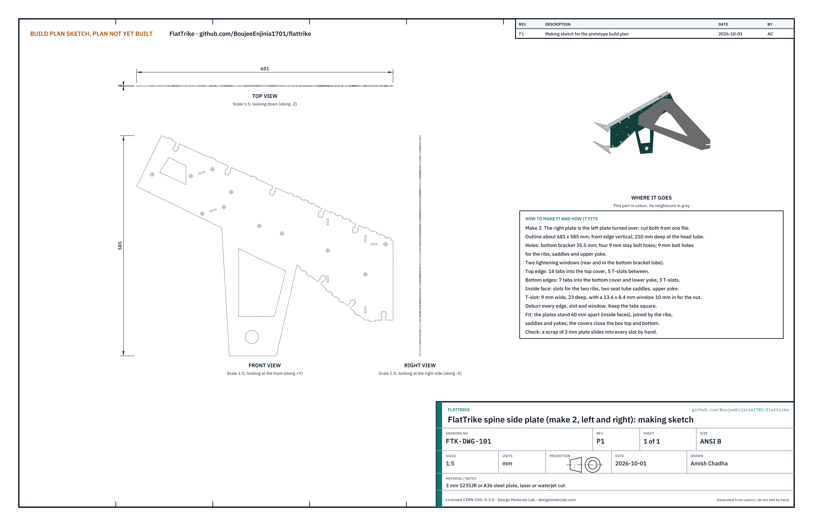

*Figure 2. Spine side plate making sketch (FTK-DWG-101).*

**What it is and what it is made from.** The two big plates that form the walls of the spine, the backbone from the seat to the head tube, with a lobe down to the bottom bracket. 3 mm S235JR or A36 steel, about 681 x 585 mm each.

**How to make it.**

1. Have both cut from the same outline; the right plate is the left one turned over.
2. Deburr. Check every slot by sliding a 3 mm offcut into it by hand.
3. Mark each plate's inside face and "L" or "R" with a paint pen.

**How it fits the parts next to it.** The plates stand 60 mm apart, inside face to inside face. The two ribs, two seat tube saddles and the upper yoke stand between them with their tabs in the plates' slots (Figure 4); the top and bottom covers lie on their edges, with the plates' edge tabs up or down through the covers' slots (Figure 9). The bottom bracket fits through the 35.5 mm holes (Figure 14) and the stays bolt on outside them (Figure 19).

**Check before moving on.** Laid one on the other, inside faces together, the two plates match all round within 1 mm.

### 3.2 Spine ribs (make 1 of each)

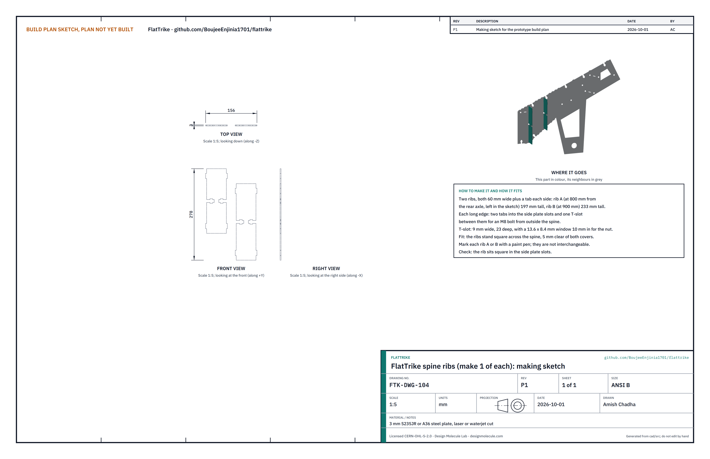

*Figure 3. Spine ribs making sketch (FTK-DWG-104): rib A, 197 mm tall, on the left; rib B, 233 mm tall, on the right.*

**What it is and what it is made from.** Two cross plates that keep the spine box square, 800 and 900 mm ahead of the rear axle. 3 mm steel, 60 mm wide plus a tab each side.

**How to make it.** Deburr, then mark A and B: they are different heights and not interchangeable.

**How it fits the parts next to it.**

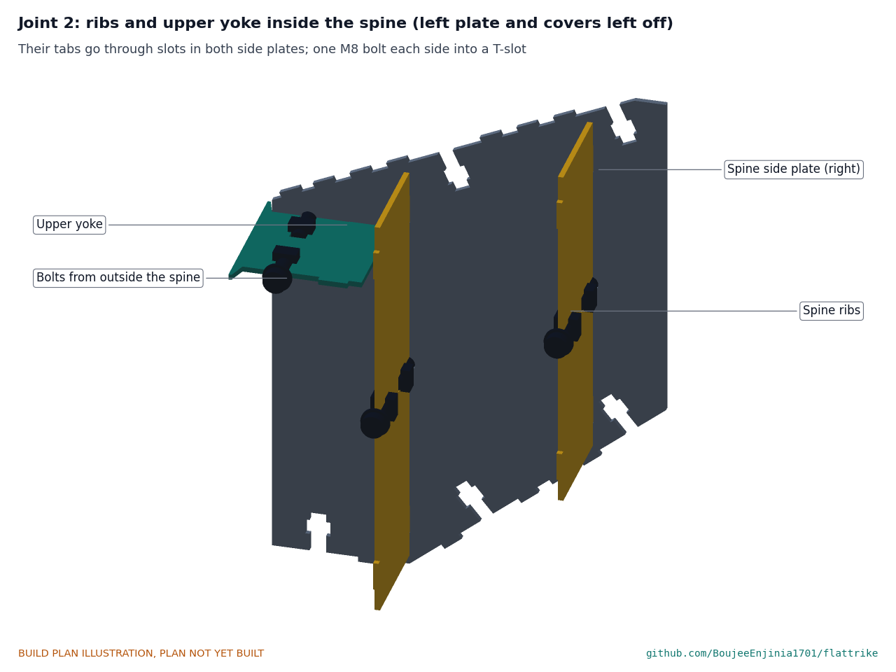

*Figure 4. Each rib's edges carry two tabs into the side plates' slots and a T-slot between them; an M8 bolt comes in from outside the spine.*

Each rib stands square across the spine, 5 mm clear of both covers.

**Check before moving on.** The rib sits square in the slots of a side plate laid flat.

### 3.3 Seat tube saddles (make 2)

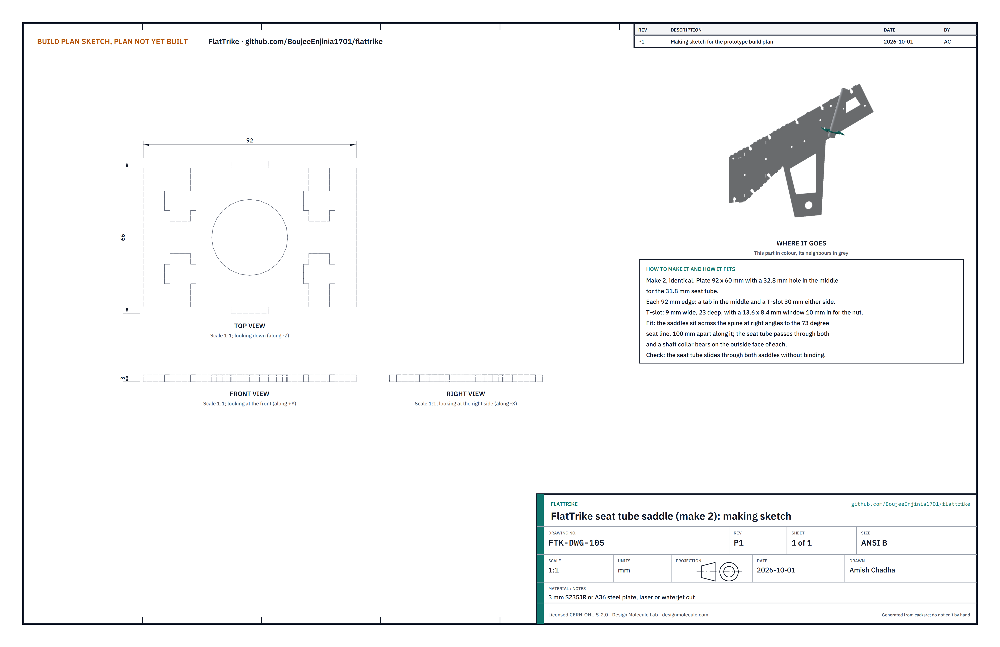

*Figure 5. Seat tube saddle making sketch (FTK-DWG-105).*

**What it is and what it is made from.** Two cross plates that hold the seat tube, one 600 mm and one 700 mm up the seat line. 3 mm steel, 92 x 60 mm with a 32.8 mm hole in the middle.

**How to make it.** Deburr the hole carefully: the seat tube must slide through without catching.

**How it fits the parts next to it.**

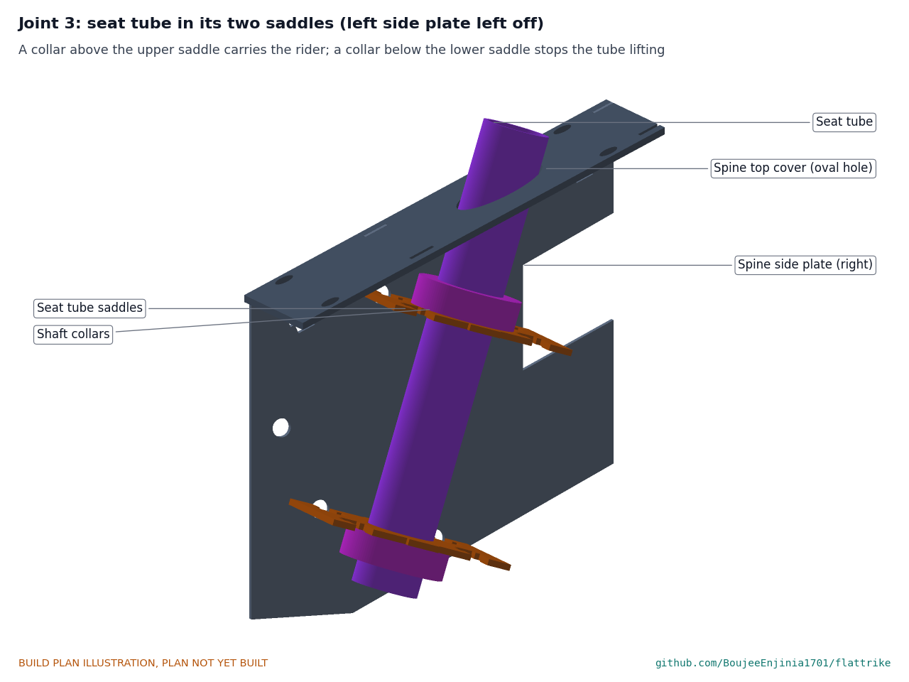

*Figure 6. The saddles sit across the spine at right angles to the 73° seat line, each held by a tab and two bolts on each side. A collar above the upper saddle carries the rider; a collar below the lower saddle stops the tube lifting.*

**Check before moving on.** A length of the seat tube slides through both saddles held in line.

### 3.4 Upper yoke

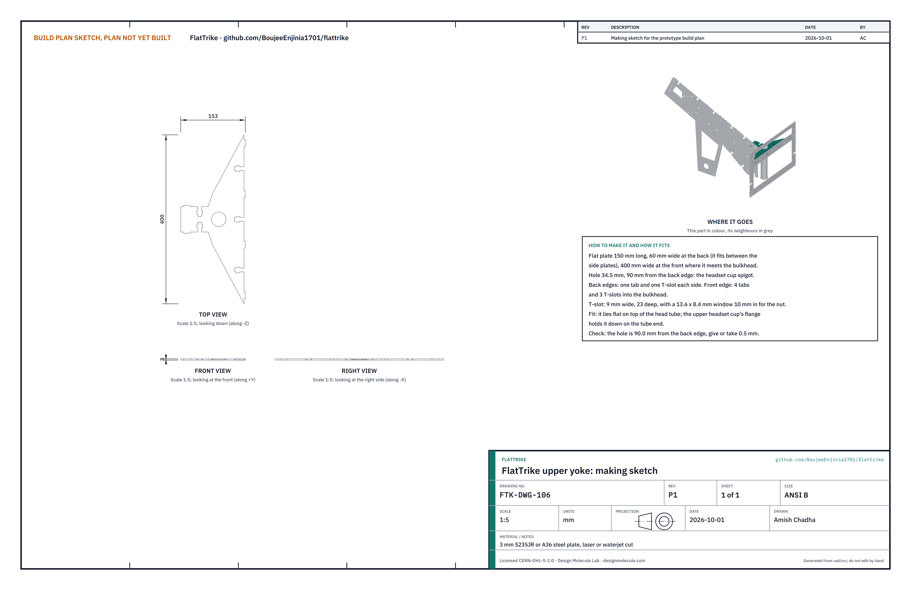

*Figure 7. Upper yoke making sketch (FTK-DWG-106).*

**What it is and what it is made from.** The plate on top of the head tube that ties it to the spine and the bed. 3 mm steel, 150 mm long, 60 mm wide at the back and 400 mm at the front, with a 34.5 mm hole 90 mm from the back edge.

**How to make it.** Deburr; check the hole is round and burr free, because a headset cup passes through it.

**How it fits the parts next to it.** Its back end stands between the spine plates, a tab and a bolt each side (Figure 4); the head tube's top end bears under it (Figure 13); its front edge's tabs go into the bulkhead (Figure 21).

**Check before moving on.** The hole is 90.0 mm from the back edge, give or take 0.5 mm.

### 3.5 Spine top cover

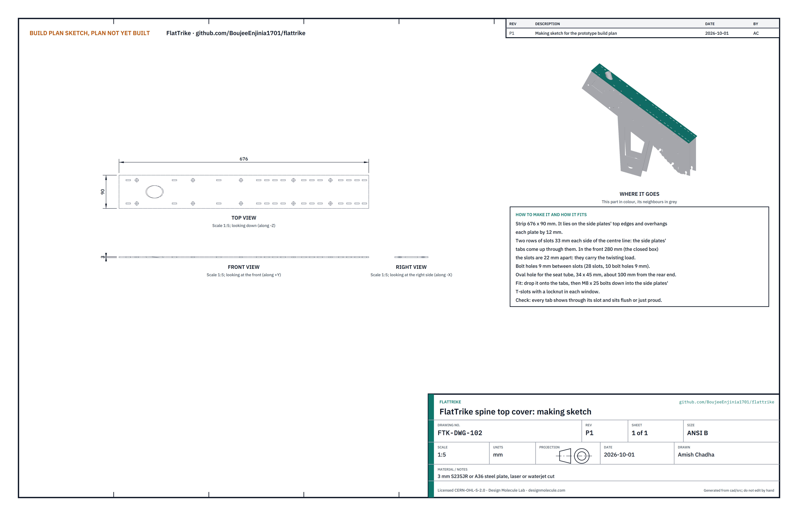

*Figure 8. Spine top cover making sketch (FTK-DWG-102).*

**What it is and what it is made from.** The strip that closes the top of the spine box. 3 mm steel, 676 x 90 mm, with two rows of slots and an oval hole for the seat tube near its rear end.

**How to make it.** Deburr; check the oval hole passes the seat tube at its slope.

**How it fits the parts next to it.**

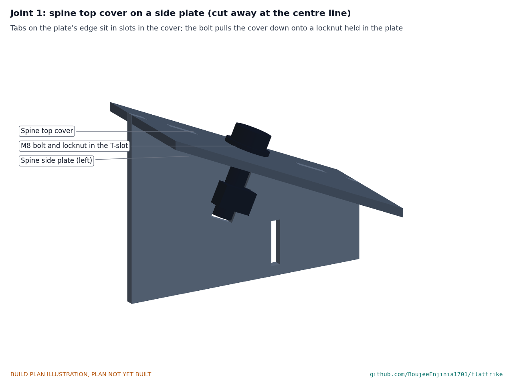

*Figure 9. The side plate's tabs come up through the cover's slots; the bolt goes down through the cover into the plate's T-slot and its locknut.*

The cover overhangs each side plate by 12 mm. In its front 280 mm, where the spine is a closed box, the slots are 22 mm apart: they carry the twisting load from the rear frame.

**Check before moving on.** Every tab shows through its slot when the cover is dropped on.

### 3.6 Spine bottom cover

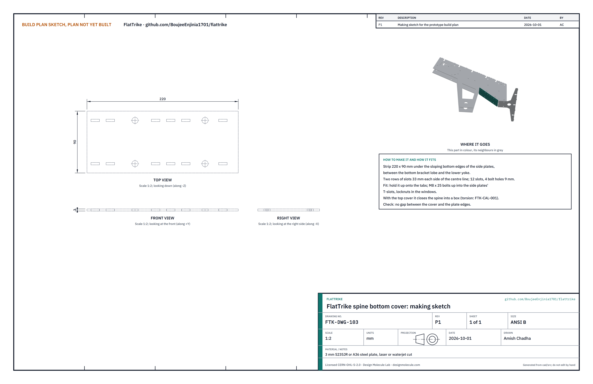

*Figure 10. Spine bottom cover making sketch (FTK-DWG-103).*

**What it is and what it is made from.** The strip that closes the bottom of the spine box between the bottom bracket lobe and the lower yoke. 3 mm steel, 220 x 90 mm.

**How to make it.** Deburr.

**How it fits the parts next to it.** As the top cover (Figure 9), upside down: the plates' bottom-edge tabs go down through it and the bolts go up.

**Check before moving on.** No gap between the cover and the plate edges when it is held up.

### 3.7 Lower yoke

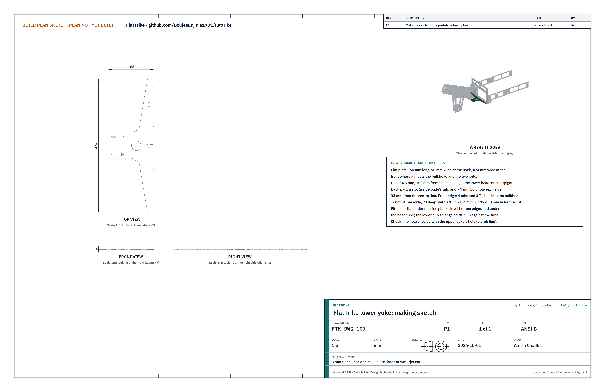

*Figure 11. Lower yoke making sketch (FTK-DWG-107).*

**What it is and what it is made from.** The plate under the head tube that ties it to the spine, the bulkhead and the rails. 3 mm steel, 160 mm long, 90 mm wide at the back and 474 mm at the front, with a 34.5 mm hole 100 mm from the back edge.

**How to make it.** Deburr; check the hole as for the upper yoke.

**How it fits the parts next to it.** Its back end lies flat under the spine plates' level bottom edges, a slot and a bolt each side; the head tube's bottom end stands on it (Figure 13); its front edge's tabs go into the bulkhead.

**Check before moving on.** Held under the upper yoke, the two holes line up on a plumb line.

### 3.8 Head tubes and seat tube

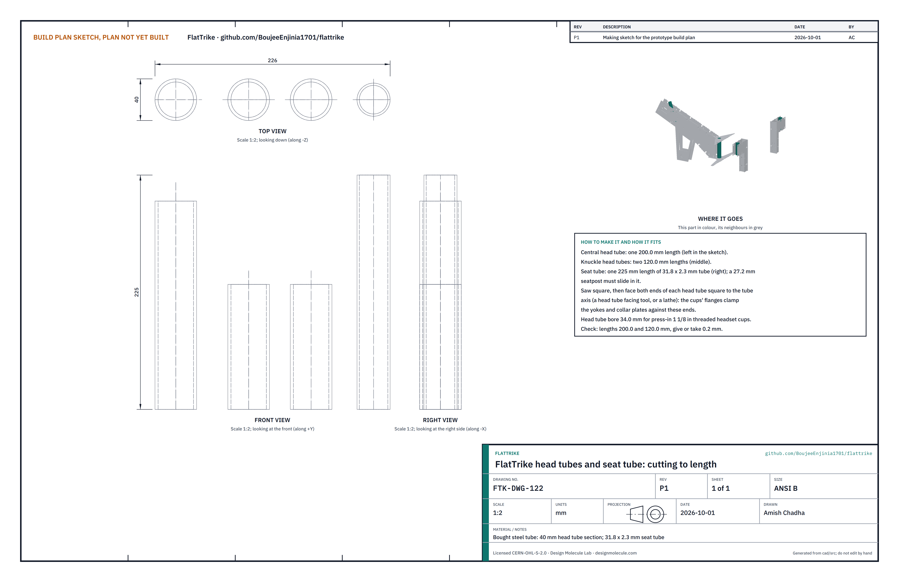

*Figure 12. Head tubes and seat tube cutting sketch (FTK-DWG-122).*

**What it is and what it is made from.** Bought steel tube: a 40 mm head tube section with a 34.0 mm bore for 1 1/8 in threaded headset cups, and 31.8 x 2.3 mm tube for the seat tube.

**How to make it.**

1. Saw one 200.0 mm and two 120.0 mm lengths of head tube, and one 225 mm length of seat tube.
2. Face both ends of each head tube square to its axis with a head tube facing tool (a bicycle workshop has one) or a lathe.
3. Deburr inside and out. Check a 27.2 mm seatpost slides in the seat tube.

**How it fits the parts next to it.**

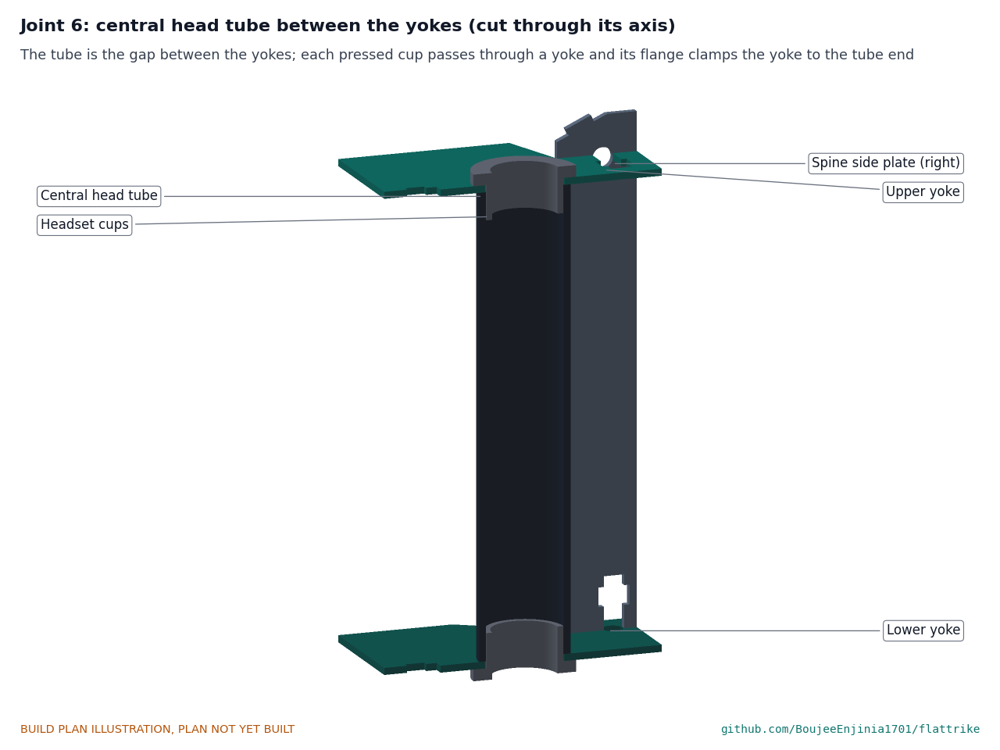

*Figure 13. The head tube fills the gap between the yokes exactly; each pressed cup passes through a yoke and its flange clamps the yoke to the tube's end.*

The 120 mm knuckle head tubes sit the same way between their collar plates (Figure 30).

**Check before moving on.** Lengths 200.0 and 120.0 mm, give or take 0.2 mm; ends square.

### 3.9 Bottom bracket shell

**What it is and what it is made from.** A bought 68 mm steel bottom bracket shell section, cut to 60.0 mm and faced, and a square-taper cartridge bottom bracket for a 68 mm shell.

**How to make it.** Saw the shell to 60.0 mm, face both ends square, and chase the threads clean.

**How it fits the parts next to it.**

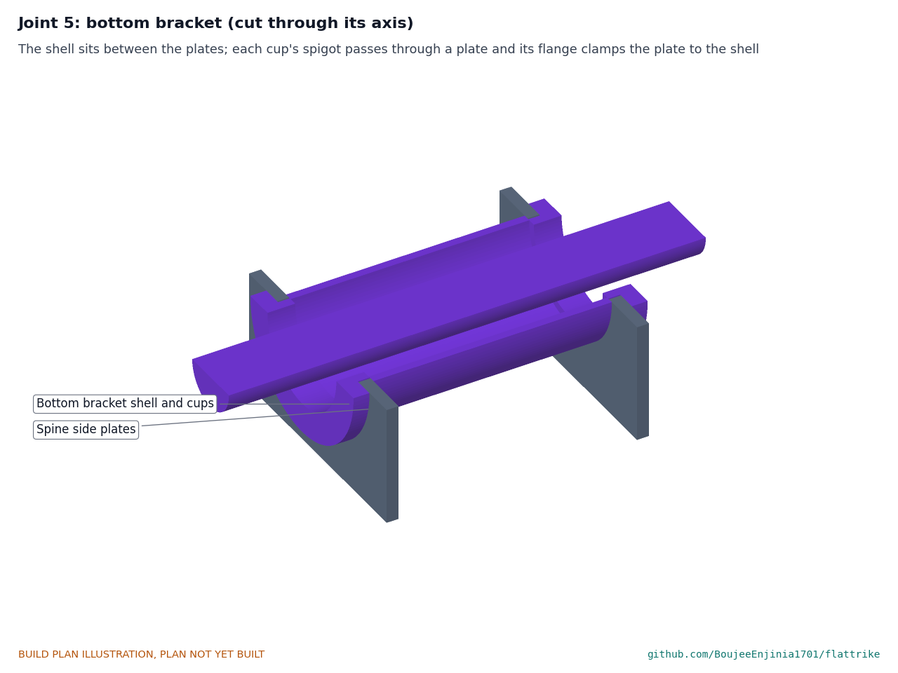

*Figure 14. The shell sits between the spine plates; each cup screws in through a plate and its flange clamps the plate to the shell.*

**Check before moving on.** The shell is 60.0 mm long, give or take 0.2 mm.

### 3.10 Rear stay plates (make 2)

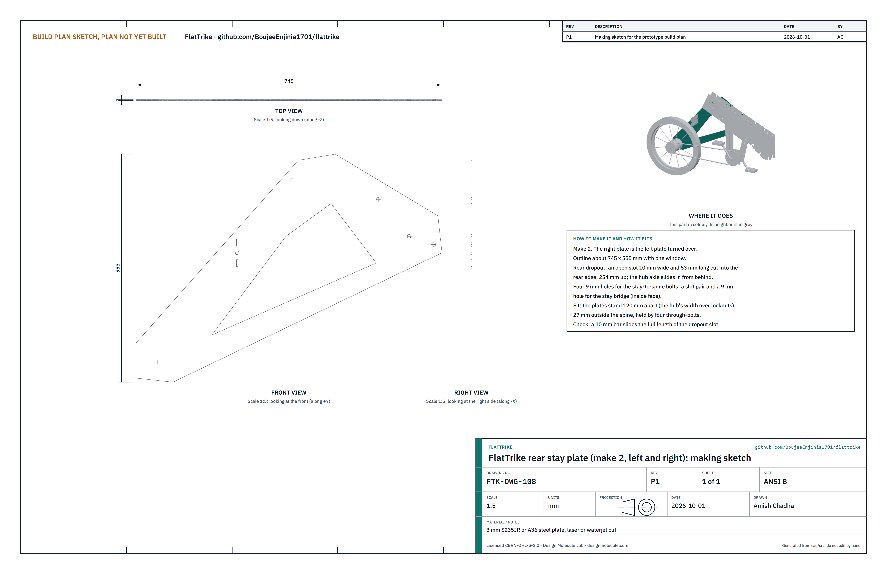

*Figure 15. Rear stay plate making sketch (FTK-DWG-108).*

**What it is and what it is made from.** The two plates that carry the rear wheel and join it to the spine. 3 mm steel, about 745 x 555 mm, with an open dropout slot in the rear edge.

**How to make it.** Deburr, especially the dropout slot: the hub axle and its washers bear on it. The right plate is the left turned over.

**How it fits the parts next to it.** The plates stand 120 mm apart, the hub's width, 27 mm outside the spine, held by four through-bolts (Figure 19) and braced by the stay bridge.

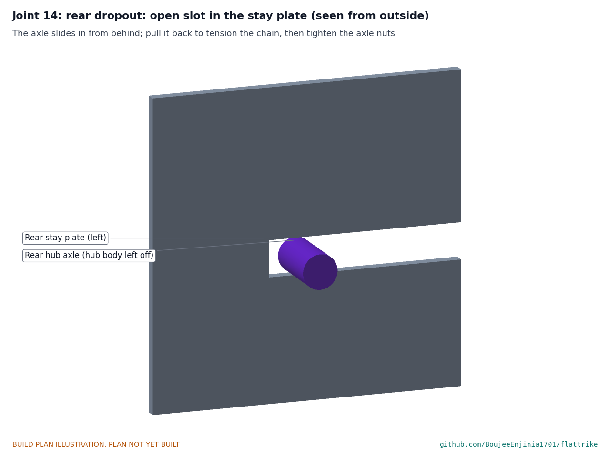

*Figure 16. The axle slides into the slot from behind; pull the wheel back to tension the chain, then tighten the axle nuts.*

**Check before moving on.** A 10 mm bar slides the full length of each dropout slot.

### 3.11 Stay bridge

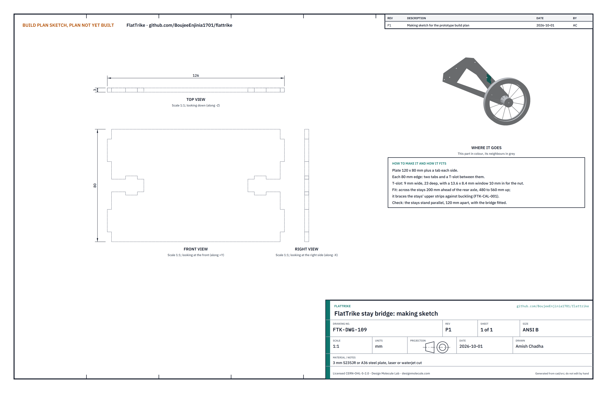

*Figure 17. Stay bridge making sketch (FTK-DWG-109).*

**What it is and what it is made from.** A cross plate between the stays that stops their upper strips buckling. 3 mm steel, 120 x 80 mm plus a tab each side.

**How to make it.** Deburr.

**How it fits the parts next to it.** Two tabs and one bolt each side into the stays, 200 mm ahead of the rear axle and 480 to 560 mm up (step 8).

**Check before moving on.** Fitted between the stays, the stays stand parallel.

### 3.12 Spacer washers and spacer tubes

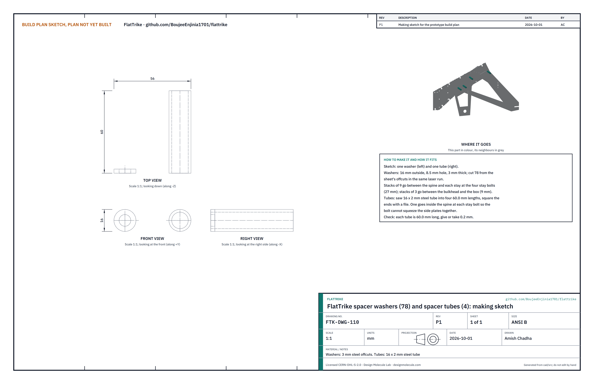

*Figure 18. Spacer washer and spacer tube making sketch (FTK-DWG-110).*

**What it is and what it is made from.** 78 washers, 16 mm outside, 8.5 mm hole, cut from the sheet's offcuts; four 60.0 mm lengths of 16 x 2 mm steel tube.

**How to make it.** Deburr the washers in a tumbler or by hand; saw and file the tubes square to length.

**How it fits the parts next to it.**

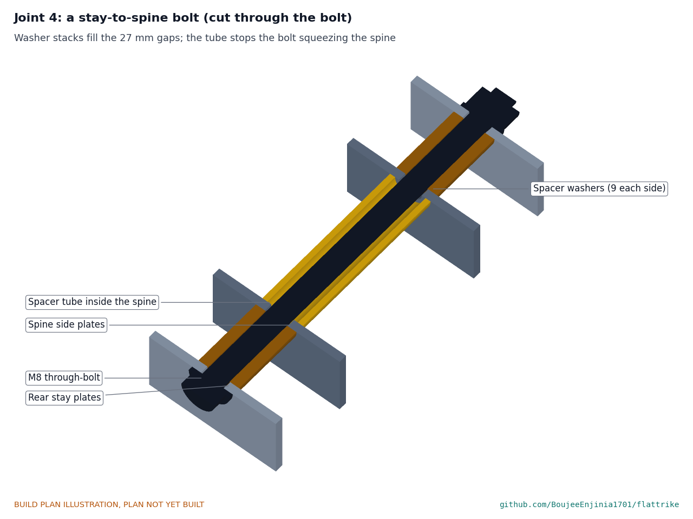

*Figure 19. Nine washers fill each 27 mm gap between spine and stay; the tube inside the spine stops the bolt squeezing it.*

Stacks of three go behind the box (Figure 38).

**Check before moving on.** Each tube is 60.0 mm long, give or take 0.2 mm.

### 3.13 Bulkhead

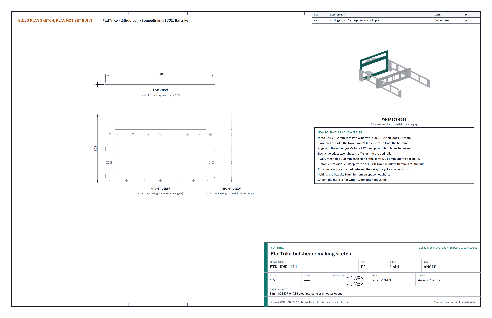

*Figure 20. Bulkhead making sketch (FTK-DWG-111).*

**What it is and what it is made from.** The cross plate at the front of the spine that the yokes, rails and box join. 3 mm steel, 474 x 302 mm, with two windows.

**How to make it.** Deburr; check it is flat within 1 mm.

**How it fits the parts next to it.**

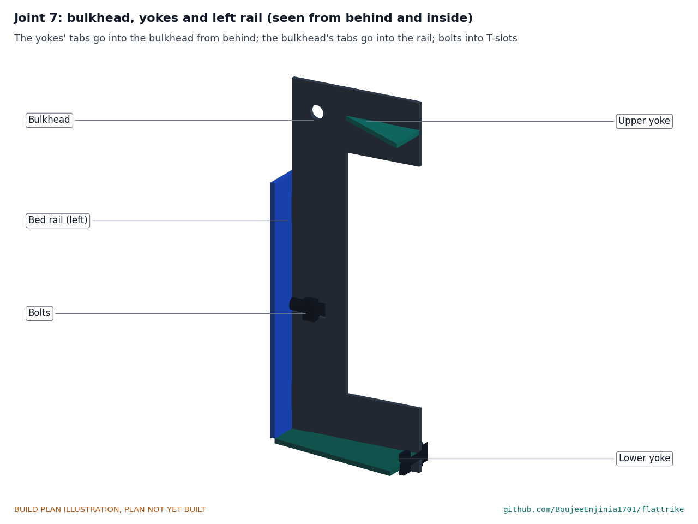

*Figure 21. The yokes' tabs go into the bulkhead from behind, the bulkhead's side tabs go into the rails, and bolts close each joint.*

**Check before moving on.** Offered up to both yokes, every yoke tab enters its slot.

### 3.14 Bed rails (make 2)

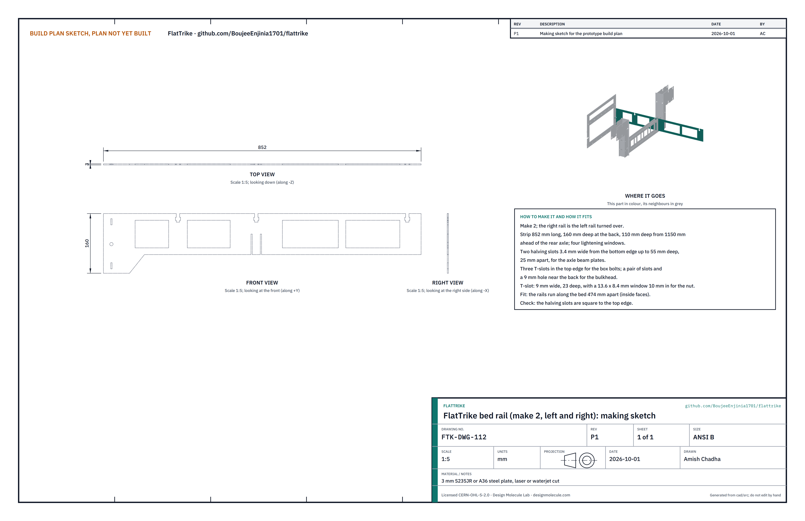

*Figure 22. Bed rail making sketch (FTK-DWG-112).*

**What it is and what it is made from.** The two side members of the bed, under the box. 3 mm steel, 852 mm long, 160 mm deep at the back and 110 mm deep from 1,150 mm ahead of the rear axle, with four windows.

**How to make it.** Deburr; the right rail is the left turned over.

**How it fits the parts next to it.**

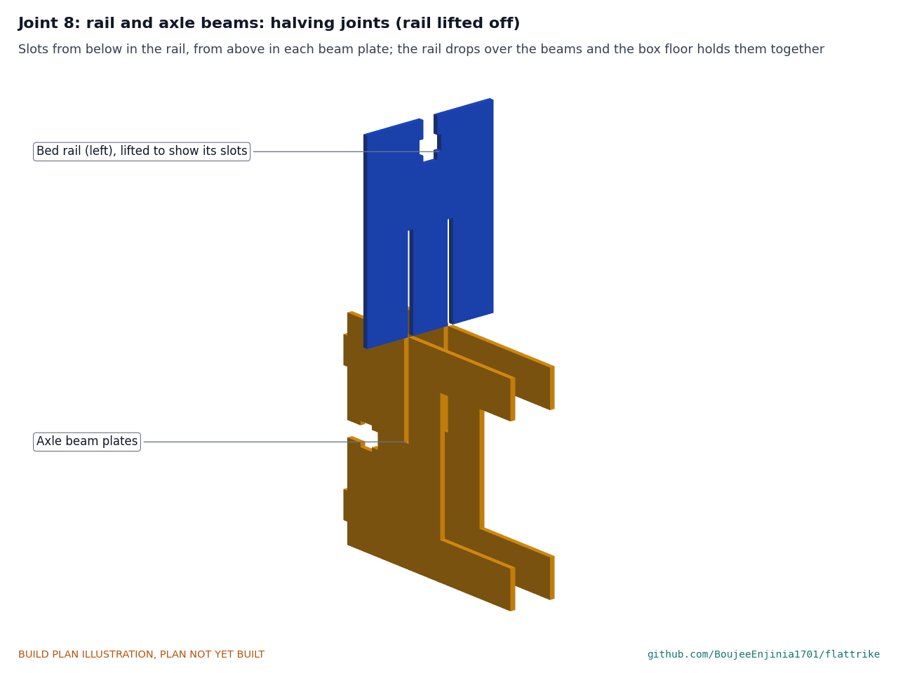

*Figure 23. Halving joints: a slot up from the rail's bottom edge and a slot down from each beam plate's top edge; the box floor holds them closed.*

**Check before moving on.** The halving slots are square to the top edge.

### 3.15 Axle beam plates (make 2)

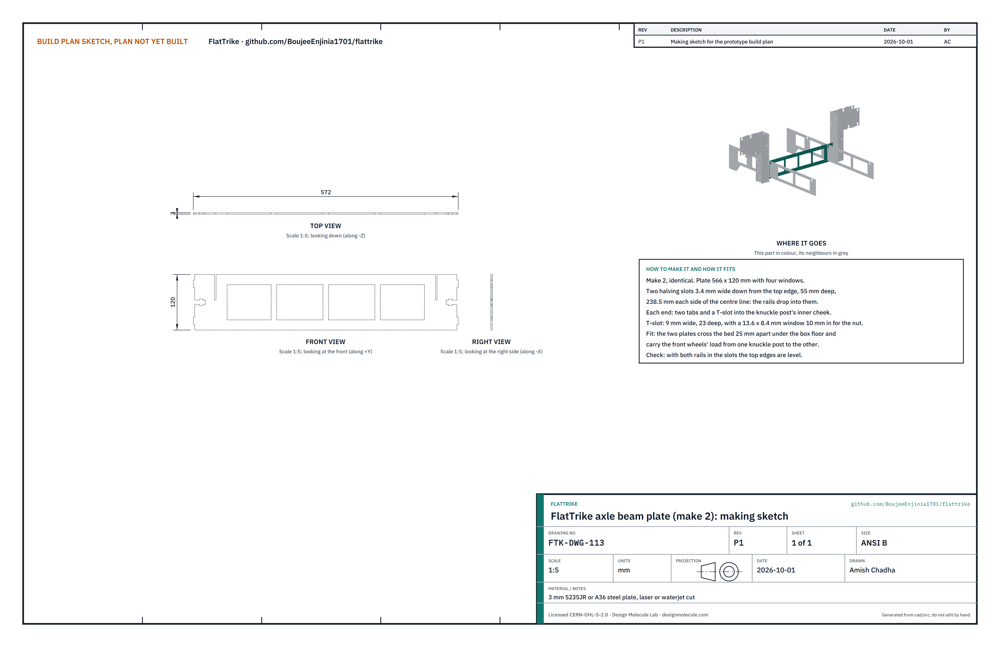

*Figure 24. Axle beam plate making sketch (FTK-DWG-113).*

**What it is and what it is made from.** Twin plates that cross the bed under the box and carry the front wheels' load from one knuckle post to the other. 3 mm steel, 566 x 120 mm, with four windows.

**How to make it.** Deburr. The two plates are the same.

**How it fits the parts next to it.** They cross the bed 25 mm apart, halved into the rails (Figure 23), with two tabs and a bolt at each end into a knuckle post's inner cheek (Figure 26).

**Check before moving on.** With both rails in the slots, the top edges are level.

### 3.16 Knuckle post plates (make 4)

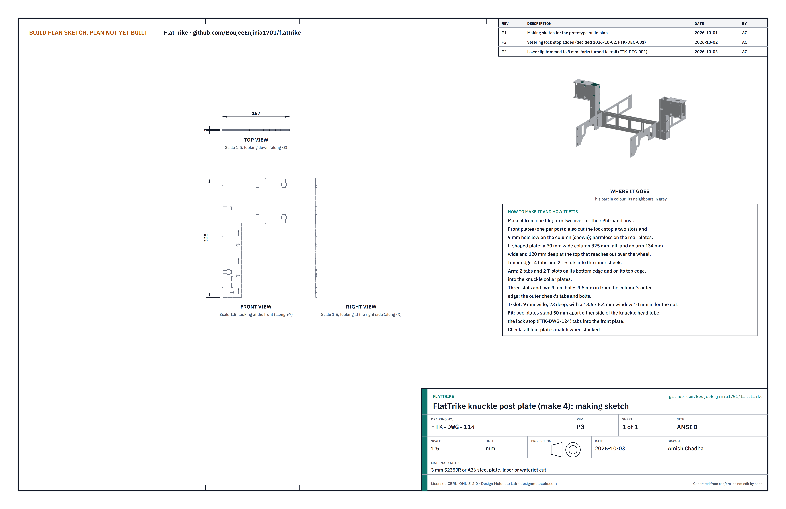

*Figure 25. Knuckle post plate making sketch (FTK-DWG-114).*

**What it is and what it is made from.** Each knuckle post, which holds a front wheel's fork, is a box of two L-shaped plates and two cheeks, with a collar plate under and over the knuckle head tube. 3 mm steel; the post plate is a column 52 mm wide and 325 mm tall with an arm 132 mm wide and 120 mm deep at the top.

**How to make it.** Deburr. All four are the same; turn two over for the right-hand post.

**How it fits the parts next to it.**

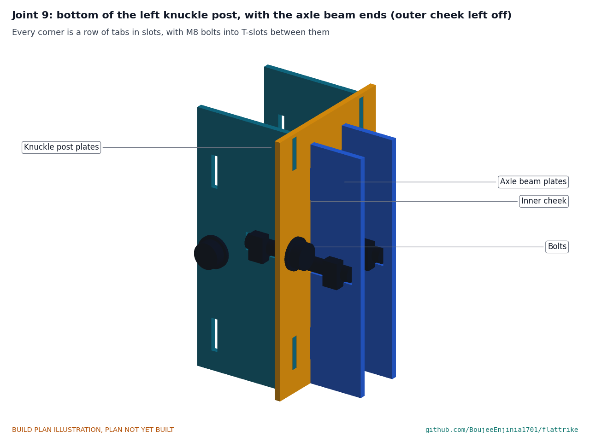

*Figure 26. The post plates' tabs go into the inner cheek; the outer cheek's tabs go into the post plates; the axle beams' end tabs go into the inner cheek. Bolts into T-slots close each joint.*

**Check before moving on.** All four plates match when stacked.

### 3.17 Knuckle post inner cheeks (make 2)

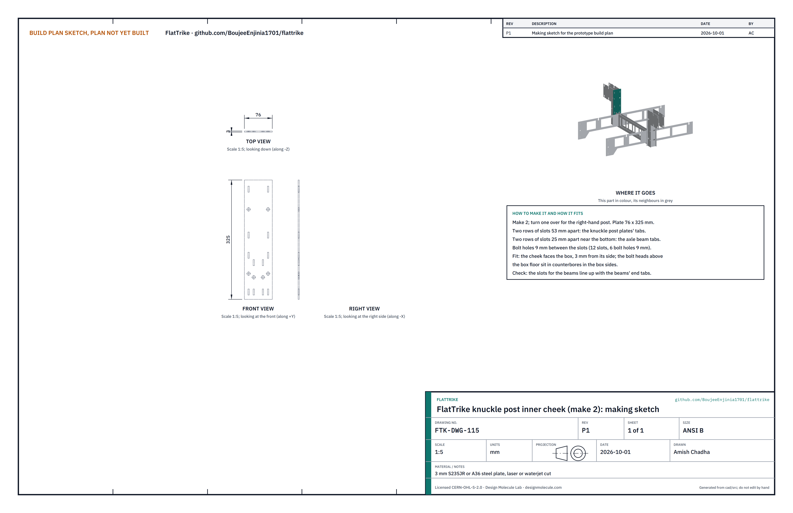

*Figure 27. Inner cheek making sketch (FTK-DWG-115).*

**What it is and what it is made from.** The post's inboard wall, facing the box. 3 mm steel, 76 x 325 mm.

**How to make it.** Deburr; turn one over for the right-hand post.

**How it fits the parts next to it.** The post plates and the axle beams tab into it (Figure 26). It stands 3 mm from the box side; the two bolt heads above the box floor sit in counterbores in the box sides (section 3.24).

**Check before moving on.** The beam slots line up with the beams' end tabs.

### 3.18 Knuckle post outer cheeks (make 2)

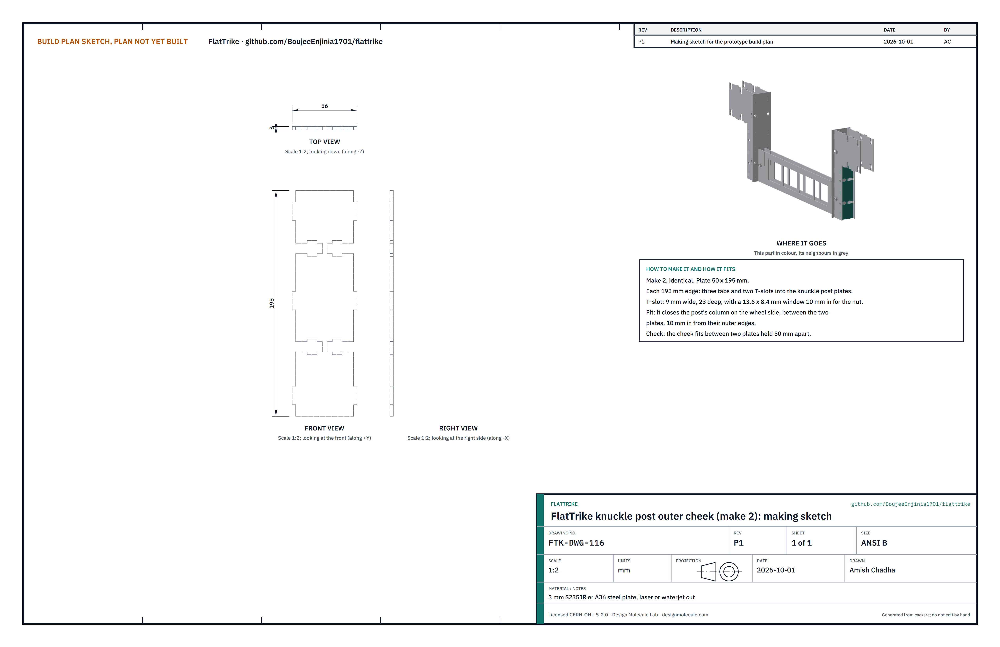

*Figure 28. Outer cheek making sketch (FTK-DWG-116).*

**What it is and what it is made from.** The post's wall on the wheel side. 3 mm steel, 50 x 195 mm.

**How to make it.** Deburr.

**How it fits the parts next to it.** It sits between the two post plates, 10 mm in from their outer edges, with three tabs and two bolts each side (Figure 26).

**Check before moving on.** It fits between two plates held 50 mm apart.

### 3.19 Knuckle collar plates (make 4)

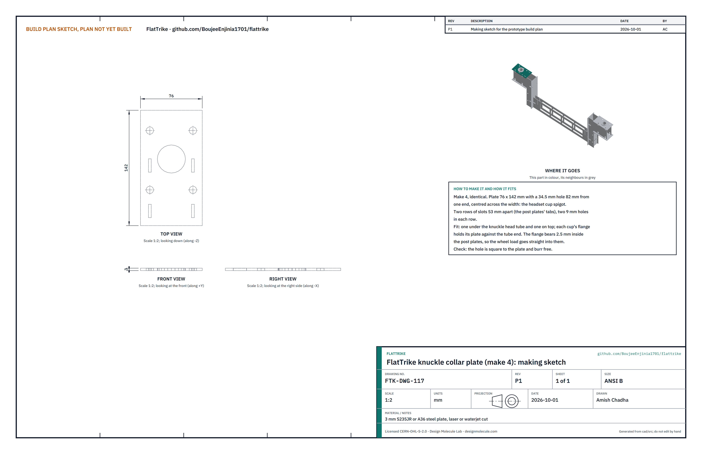

*Figure 29. Knuckle collar plate making sketch (FTK-DWG-117).*

**What it is and what it is made from.** The plates under and over each knuckle head tube. 3 mm steel, 76 x 142 mm, with a 34.5 mm hole 82 mm from one end.

**How to make it.** Deburr the hole carefully.

**How it fits the parts next to it.**

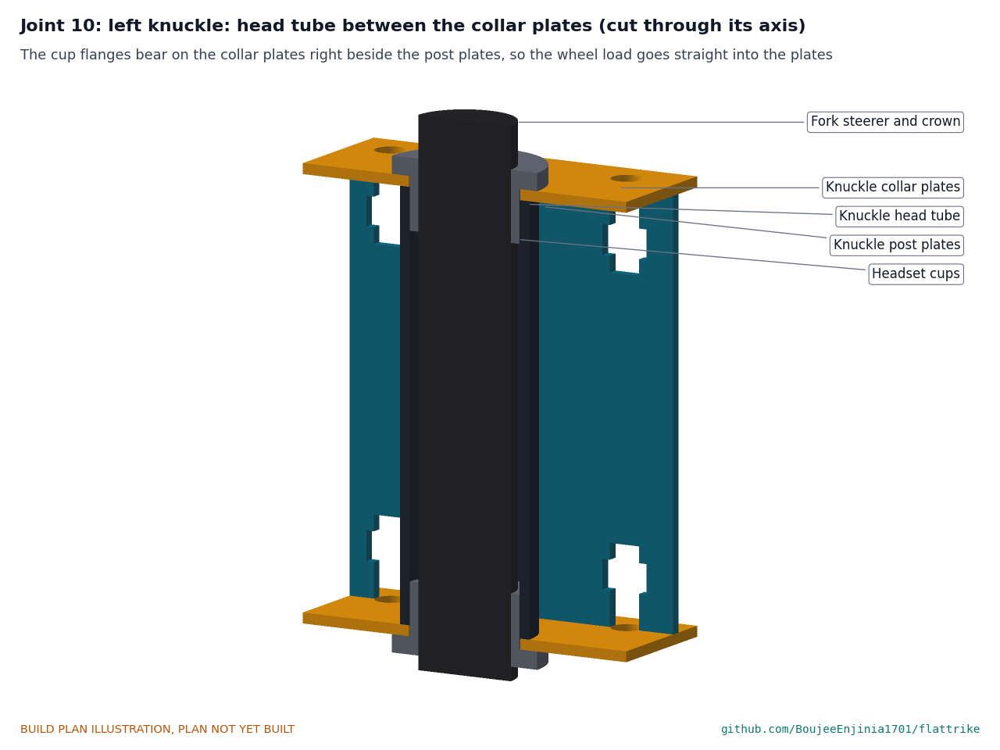

*Figure 30. Each cup's flange bears on its collar plate right beside the post plates, so a wheel's load goes straight into the plates.*

The post plates' arms tab into the collar plates, two tabs and two bolts each.

**Check before moving on.** The hole is square to the plate and burr free.

### 3.20 Steering column

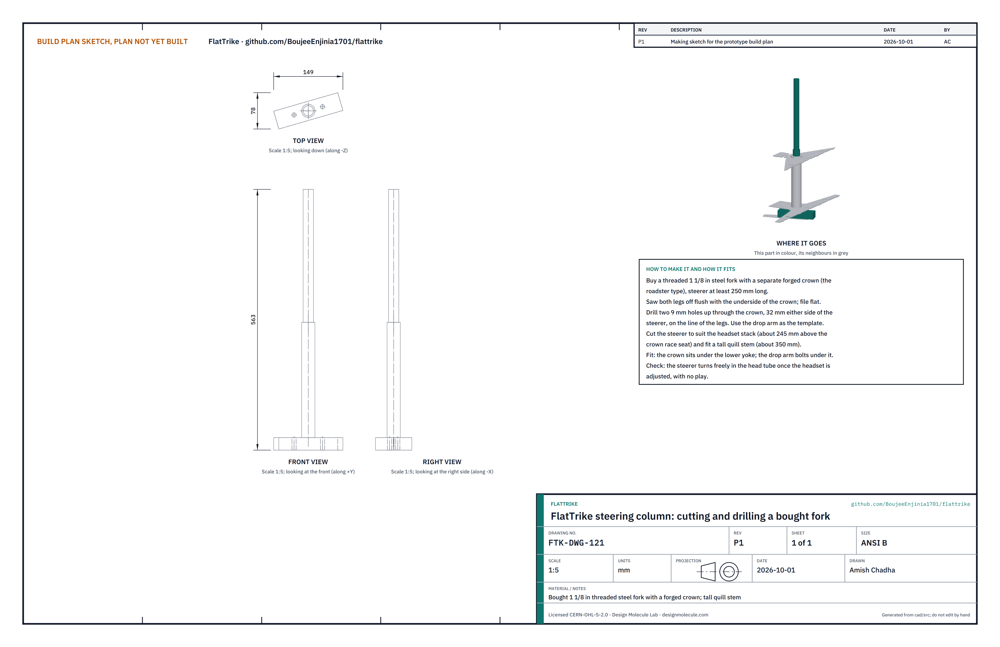

*Figure 31. Steering column cutting and drilling sketch (FTK-DWG-121).*

**What it is and what it is made from.** A bought 1 1/8 in threaded steel fork with a separate forged crown (the roadster type), with a steerer at least 250 mm long, and a tall quill stem.

**How to make it.**

1. Saw both legs off flush with the underside of the crown and file it flat.
2. Clamp the drop arm under the crown as a template, on the line of the legs, and drill two 9 mm holes up through the crown, 32 mm either side of the steerer.
3. Cut the steerer to suit the headset stack, about 245 mm above the crown race seat.

**How it fits the parts next to it.** The steerer runs up through the central head tube on its headset; the crown sits under the lower yoke; the drop arm bolts under the crown (Figure 33).

**Check before moving on.** The drop arm's holes line up with the crown's.

### 3.21 Drop arm

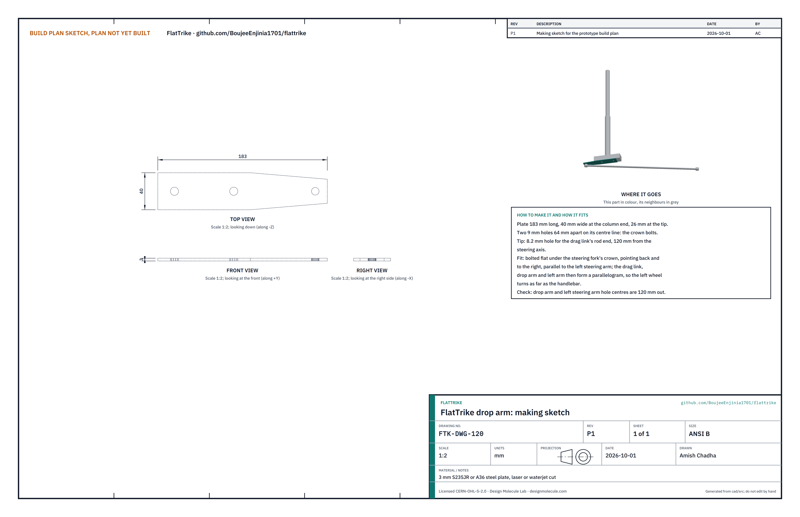

*Figure 32. Drop arm making sketch (FTK-DWG-120).*

**What it is and what it is made from.** The arm under the steering column that drives the left wheel through the drag link. 3 mm steel, 183 mm long.

**How to make it.** Deburr.

**How it fits the parts next to it.**

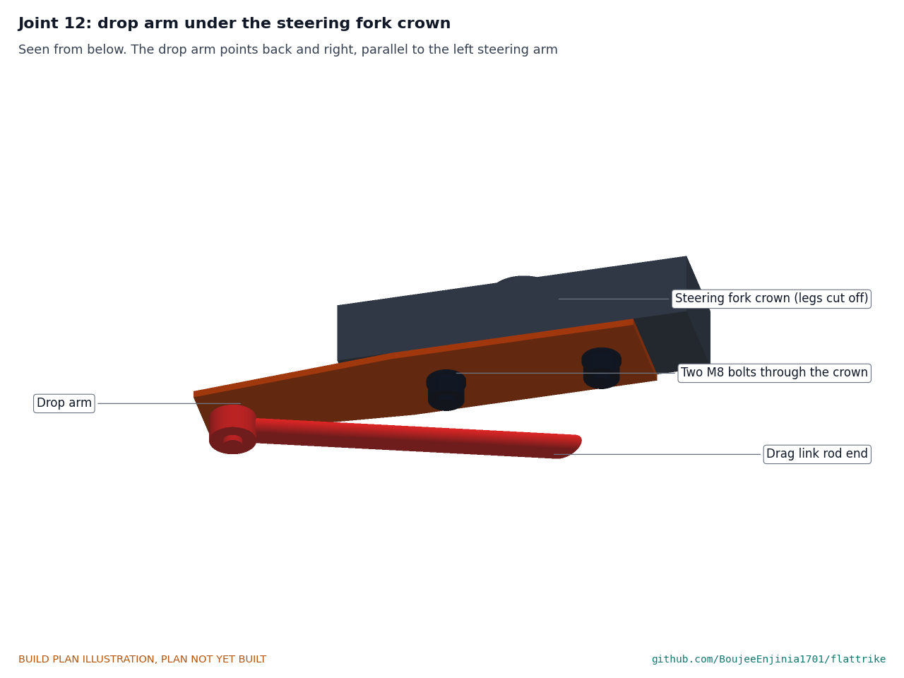

*Figure 33. Two M8 bolts through the crown hold the drop arm; the drag link's rod end bolts under its tip.*

The drop arm points back and to the right, parallel to the left steering arm and 120 mm long like it, so the column, drop arm, drag link and left arm form a parallelogram.

**Check before moving on.** Its tip hole is 120 mm from the steering axis, give or take 1 mm.

### 3.22 Steering arms (make 2)

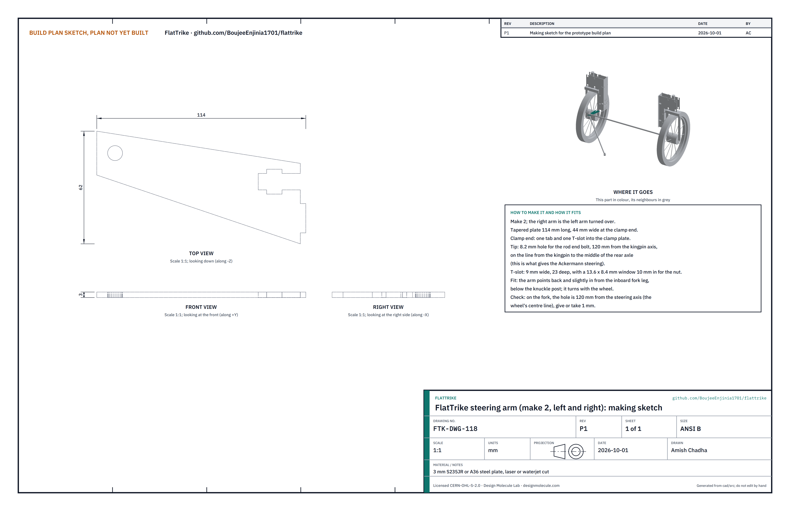

*Figure 34. Steering arm making sketch (FTK-DWG-118).*

**What it is and what it is made from.** One arm on each front fork, joined by the tie rod. 3 mm steel, 114 mm long, 44 mm wide at the clamp end.

**How to make it.** Deburr; the right arm is the left turned over.

**How it fits the parts next to it.** Its tip hole is 120 mm from the wheel's steering axis, on the line from the steering axis to the middle of the rear axle; this is what makes the inner wheel turn more than the outer one. It tabs and bolts into the clamp plate (Figure 36).

**Check before moving on.** On the fork, the tip hole is 120 mm from the steering axis, give or take 1 mm.

### 3.23 Steering arm clamp plates (make 2)

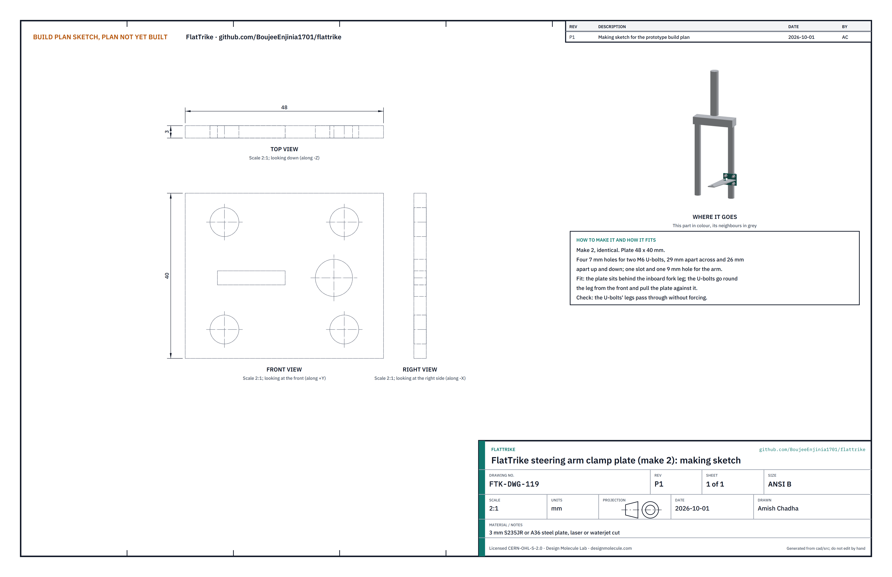

*Figure 35. Steering arm clamp plate making sketch (FTK-DWG-119).*

**What it is and what it is made from.** A small plate that clamps each steering arm to its fork leg. 3 mm steel, 48 x 40 mm.

**How to make it.** Deburr.

**How it fits the parts next to it.**

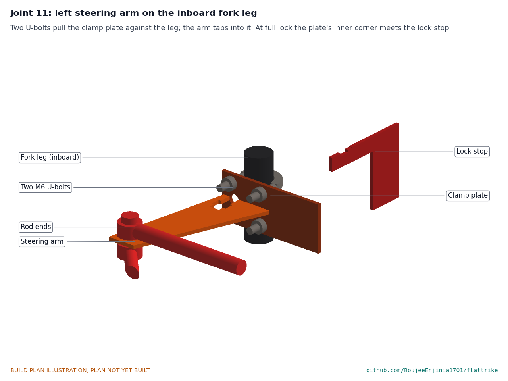

*Figure 36. Two M6 U-bolts go round the leg from the front and pull the clamp plate against it; the arm tabs and bolts into the plate. The drag link's rod end is under the left arm and the tie rod's on top.*

The arm sits 321 mm up, under the knuckle post, and turns with the wheel.

**Check before moving on.** The U-bolts' legs pass through the plate without forcing.

### 3.24 Cargo box

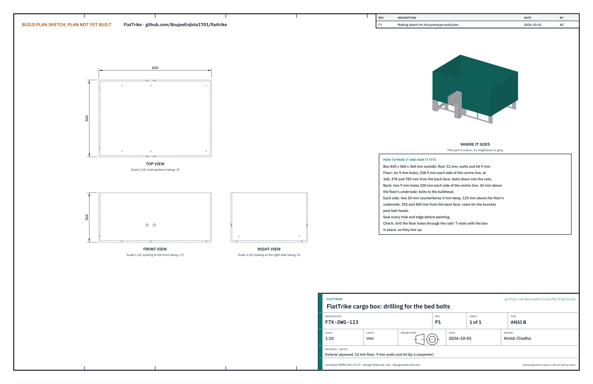

*Figure 37. Cargo box drilling sketch (FTK-DWG-123).*

**What it is and what it is made from.** A lockable exterior plywood box, 820 x 560 x 360 mm outside, 12 mm floor, 9 mm walls and lid, made by a carpenter. The lid is the counter.

**How to make it.**

1. Have the carpenter build the box, hinge the lid and fit the hasp.
2. Drill two 9 mm holes in the back, 220 mm each side of the centre line, 42 mm above the floor's underside.
3. Drill two 20 mm counterbores 5 mm deep in each side, 125 mm above the floor's underside, 352 and 405 mm from the back face, for the knuckle post bolt heads.
4. The six floor holes are drilled at step 20 through the rails' T-slots, so they line up.
5. Seal every hole and edge and paint the box.

**How it fits the parts next to it.**

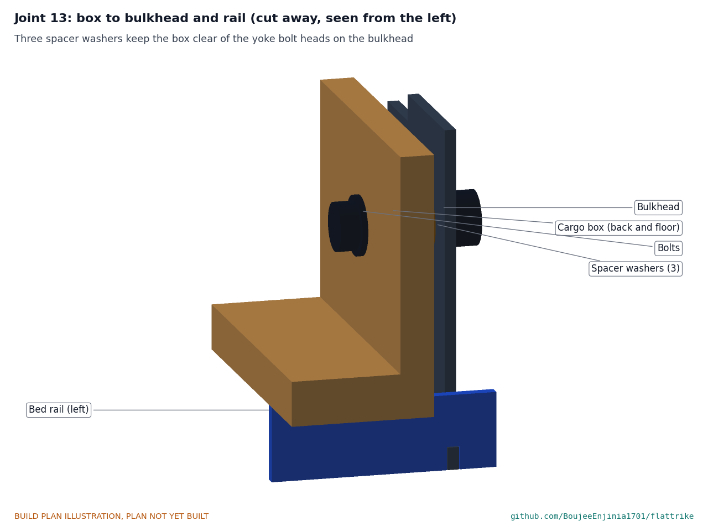

*Figure 38. Three spacer washers keep the box 9 mm off the bulkhead, clear of the yoke bolt heads; floor bolts go down into the rails.*

**Check before moving on.** The box sits flat on the rails and beams with the lid closed and locked.

### 3.25 Bought components

Buy to specification, not brand. Line numbers are those of the bill of materials.

- **Plate (lines 1 to 4).** One 1,250 x 2,500 x 3 mm sheet of S235JR or A36 steel, cut by a laser or waterjet shop from the model's outlines with the washers in the windows.
- **Fasteners (lines 4 and 5).** 95 sets of M8 class 8.8 zinc-plated bolts with washers and all-metal prevailing-torque locknuts: 78 at 25 mm for the tab joints, eight at 35 mm for the box, four at 140 mm for the stay bolts, two at 45 mm for the drop arm and three at 40 mm for the rod ends; four M6 U-bolts for a 22 mm fork leg.
- **Steering (line 5).** Three 1 1/8 in threaded headsets; two 20 in steel forks for 100 mm hubs; one 1 1/8 in threaded fork with a forged crown for the column; a tall quill stem (about 350 mm quill); three M8 rod ends with at least ±10° misalignment, on a drag link and a tie rod.
- **Front wheels (line 6).** Two 20 x 2.125 in (ISO 406) wheels with drum brake hubs 100 mm over locknuts, hub bodies 90 mm across or less.
- **Rear wheel (line 7).** 20 x 2.125 in with a 3-speed drum brake hub, 120 mm over locknuts, 24T sprocket and shifter.
- **Drivetrain (line 8).** Square-taper cartridge bottom bracket for a 68 mm shell, 170 mm cranks, 32T chainring, 1/8 in chain, pedals, chain guard.
- **Seat (line 10).** 31.8 x 2.3 mm seat tube, two 32 mm shaft collars, seat clamp, 27.2 mm seatpost, sprung saddle.
- **Bars and brakes (lines 11 and 12).** Steel riser bar and grips; two brake levers with a parking lock on the front pair; a cable splitter for the two front drums; cables and housing.
- **Finish and accessories (lines 13 and 14).** Zinc-rich primer and enamel or powder coat; mudguards, reflectors, bell, box bumpers and the cornering-speed label.

## 4. Putting it together

In each picture the parts already fitted are grey and the parts being fitted are in colour, with an arrow showing the way they go in. Tighten every M8 bolt to 25 N·m once its sub-assembly is square, unless a step says otherwise.

### Step 1: ribs, saddles and upper yoke into the left side plate

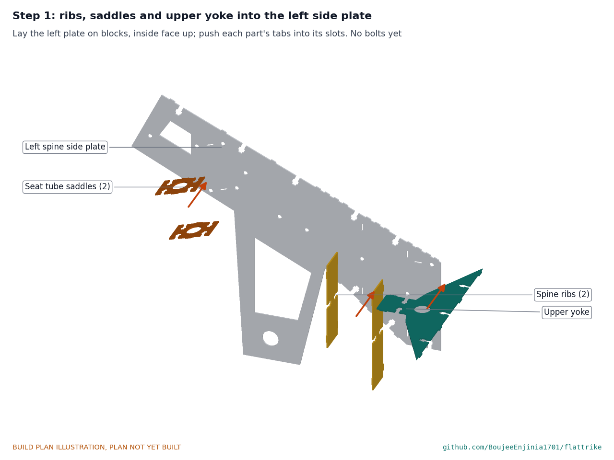

Lay the left plate inside face up on blocks. Push each rib, saddle and the upper yoke's tabs into its slots. No bolts yet.

### Step 2: right side plate onto the tabs

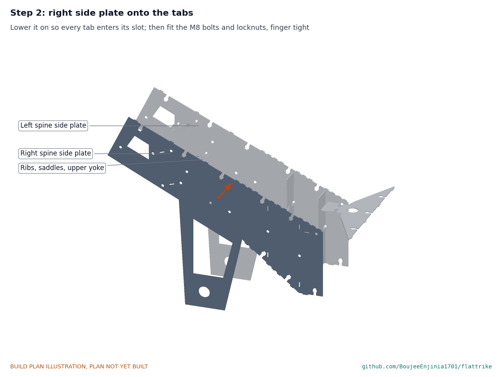

Lower the right plate on so every tab enters its slot; tap it down with a soft mallet. Fit the bolts and locknuts finger tight.

### Step 3: top cover

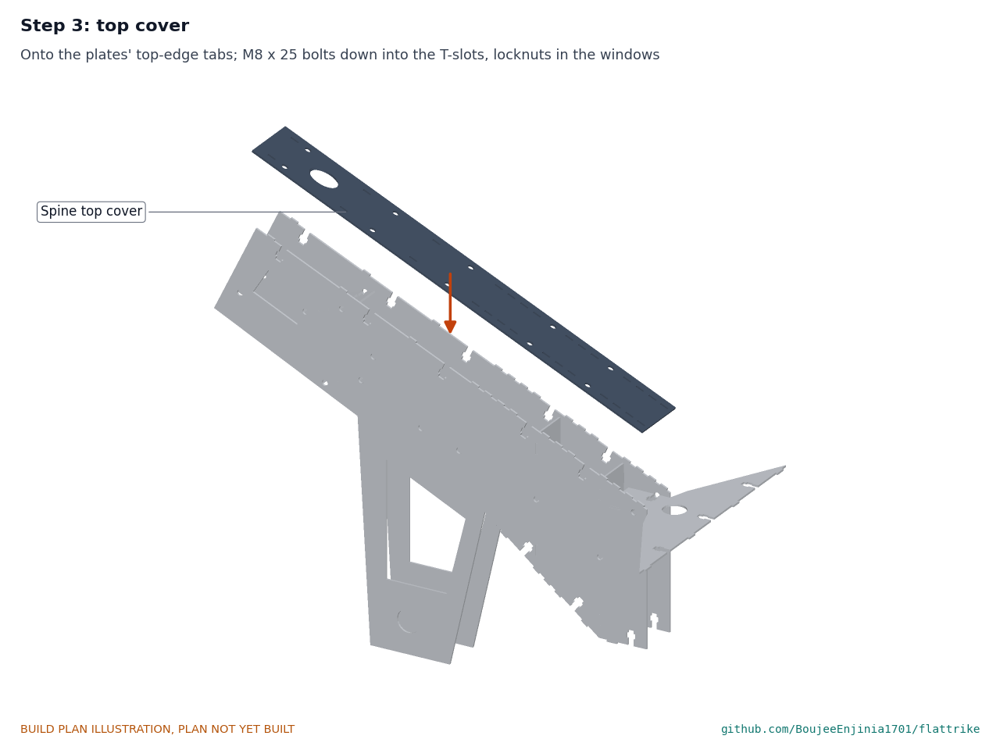

Onto the plates' top-edge tabs; M8 x 25 bolts down into the T-slots with a locknut in each window.

### Step 4: bottom cover and lower yoke

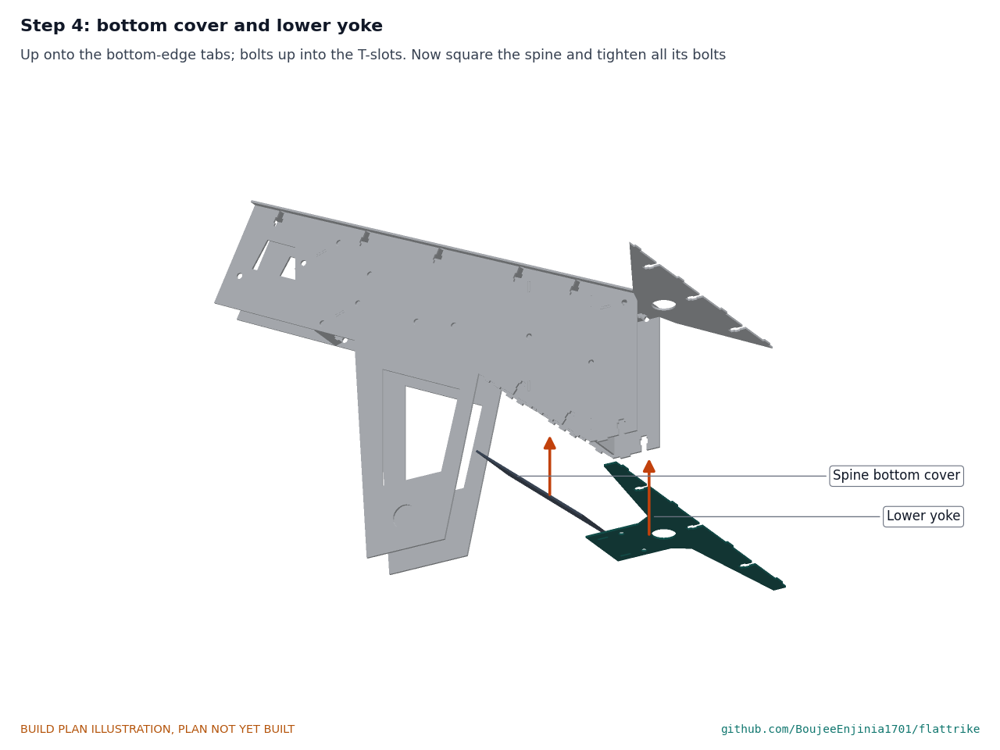

Up onto the bottom-edge tabs; bolts up into the T-slots. **Hold point:** measure the spine's diagonals and check it is not twisted on a flat floor, then tighten all its bolts.

### Step 5: head tube between the yokes

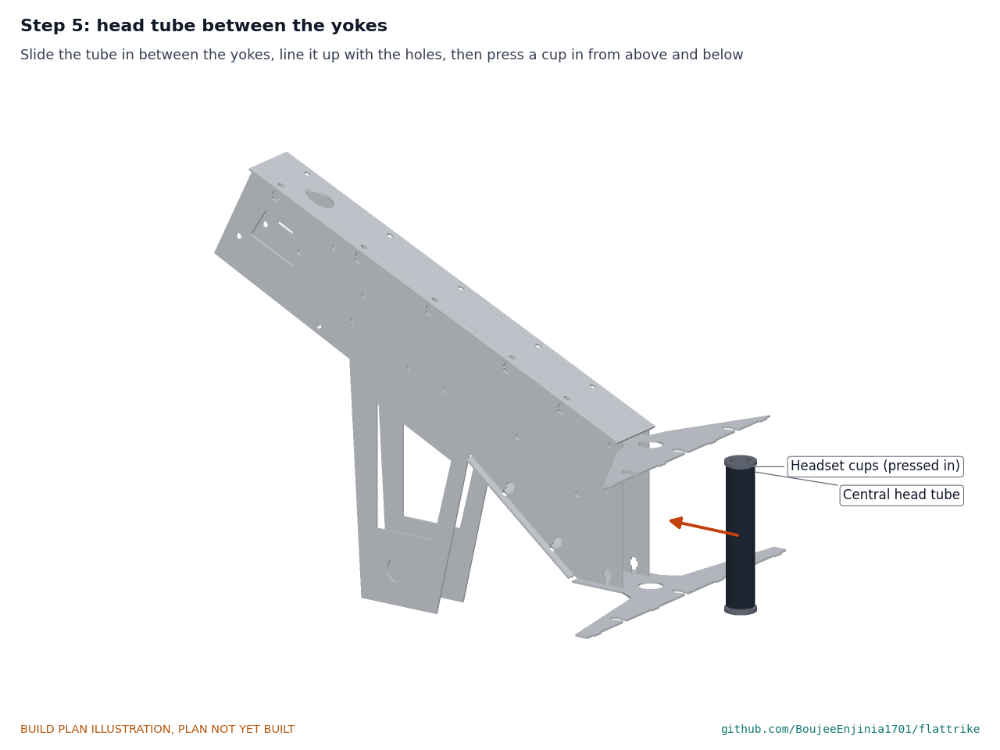

Slide the 200 mm tube in between the yokes and line it up with their holes. Press the lower and upper headset cups in through the yokes with a headset press until each flange is hard against its yoke.

### Step 6: bottom bracket

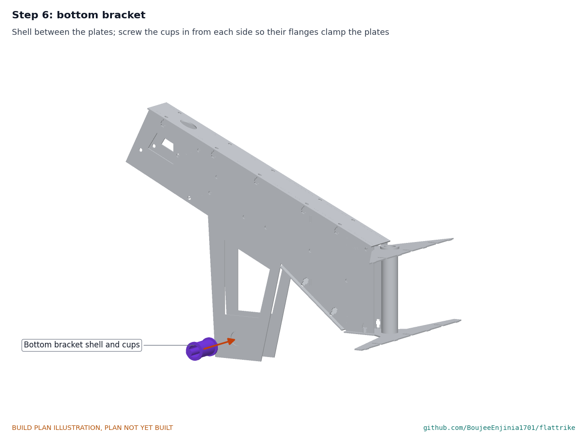

Hold the shell between the plates; screw the cups in from each side, the drive-side cup (left-hand thread) on the right, to the maker's torque.

### Step 7: seat tube

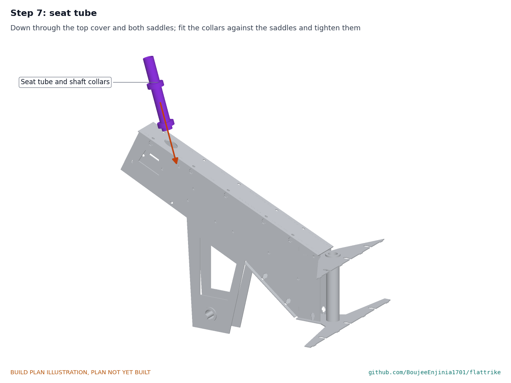

Down through the top cover and both saddles, with the upper collar threaded on above the upper saddle as it passes. Tighten the collars against the saddles.

### Step 8: stay bridge between the stays

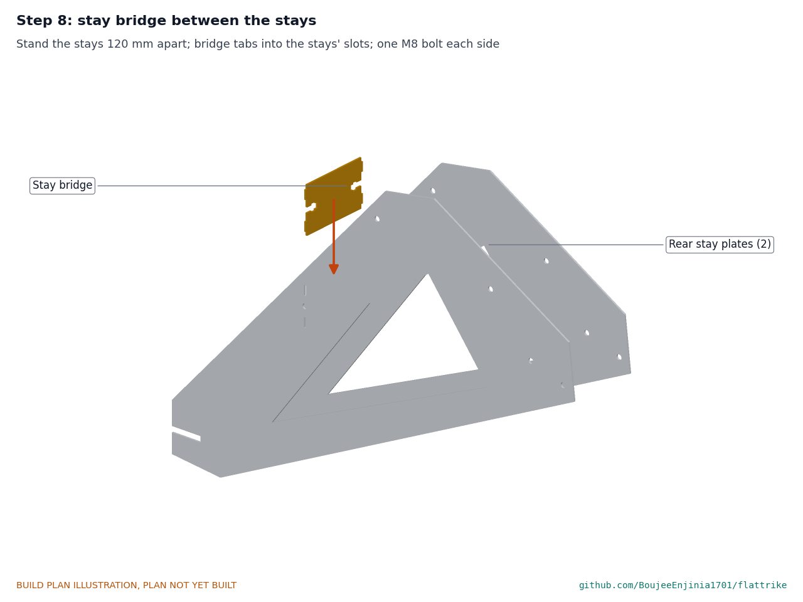

Stand the stays 120 mm apart, bridge tabs in their slots, one bolt each side.

### Step 9: stays onto the spine

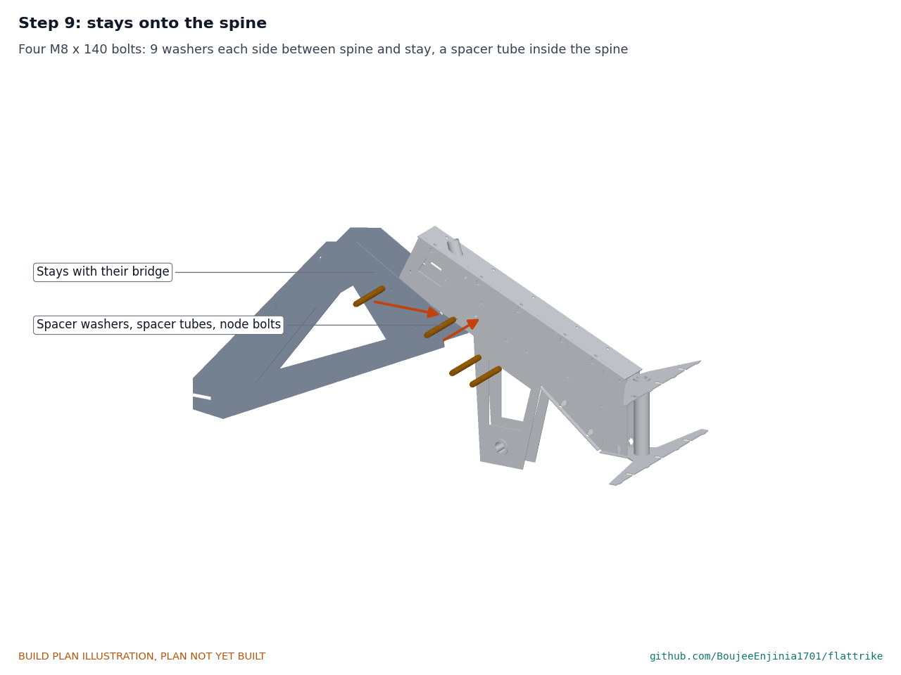

Four M8 x 140 bolts: nine washers each side between spine and stay, a spacer tube inside the spine, a locknut on the far side. Check both dropouts line up across the trike before tightening.

### Step 10: bulkhead onto the yokes

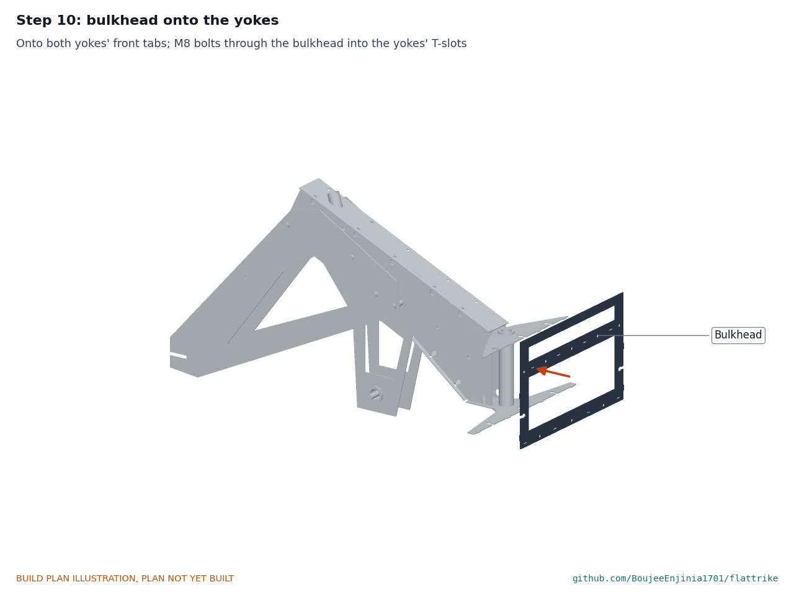

Onto both yokes' front tabs; bolts through the bulkhead into the yokes' T-slots.

### Step 11: bed rails onto the bulkhead

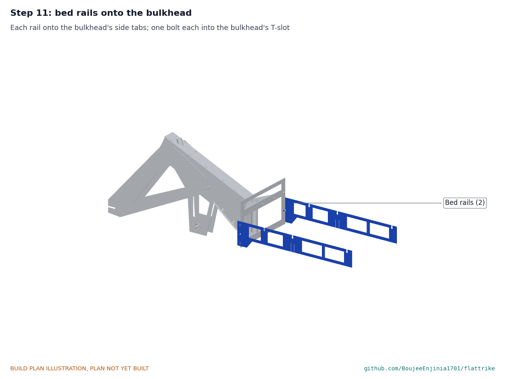

Each rail onto the bulkhead's side tabs and against the lower yoke's front corner; one bolt each into the bulkhead's T-slot.

### Step 12: axle beams up into the rails

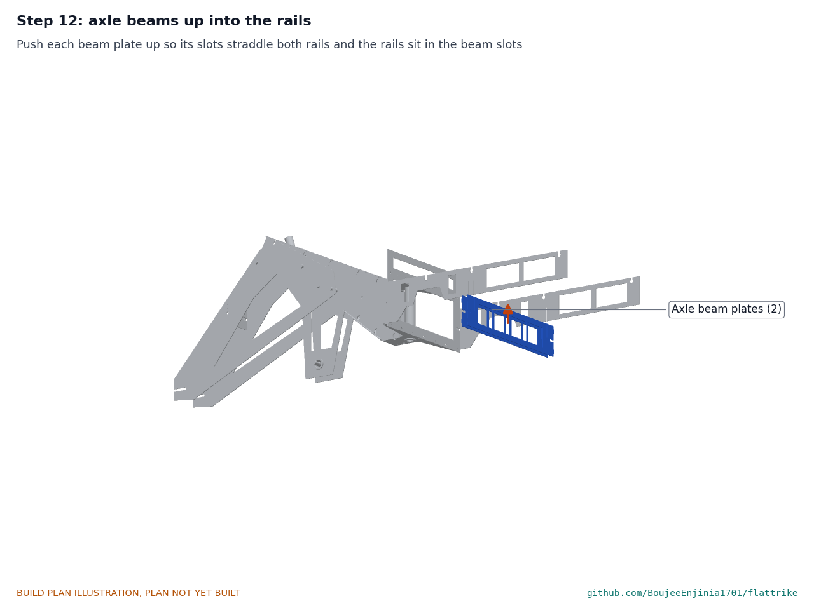

Push each beam plate up from below so its slots straddle both rails and the rails sit in the beam's slots. Tap them home until all top edges are level.

### Step 13: build each knuckle post (left shown)

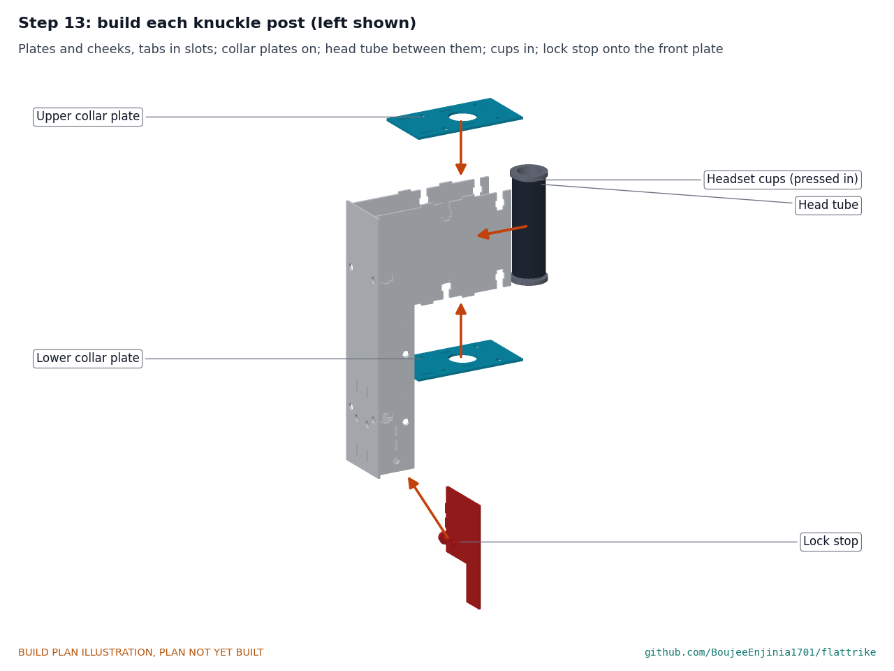

Post plates into the inner cheek, outer cheek between the plates, collar plates on top and bottom, all bolted finger tight; slide the 120 mm head tube in between the collar plates and press its cups in. Then tighten.

### Step 14: knuckle posts onto the axle beams


Each post's inner cheek onto the beams' end tabs; bolts through the cheek into the beams. **Hold point:** with a straight edge across both knuckle head tubes, check they are parallel and plumb, and the posts are 840 mm apart centre to centre.

### Step 15: steering column and drop arm


Crown race onto the crown; steerer up through the head tube; adjust the headset so the column turns freely with no play. Bolt the drop arm under the crown.

### Step 16: front forks and wheels


Each fork's steerer up through its knuckle head tube; adjust the headsets; fit the wheels in the dropouts with the drum brake reaction arms clipped to the legs.

### Step 17: steering arms onto the fork legs


Clamp plate behind each inboard leg, 303 to 343 mm up; two U-bolts round the leg from the front; arm tabs into the plate, one bolt.

### Step 18: tie rod and drag link


Drag link's rod end under the drop arm's tip and under the left steering arm; tie rod's rod ends on top of both steering arms; locknuts on all three bolts. Set the tie rod's length so both wheels point straight ahead with the handlebar square, then set the U-bolts tight. **Hold point:** turn from full left to full right lock: nothing may touch.

### Step 19: rear wheel and drivetrain


Axle into the open dropouts with the hub's non-turn washers; chainring, cranks and pedals on; chain on; pull the wheel back to tension the chain, then tighten the axle nuts. Set the hub gear's cable.

### Step 20: cargo box onto the bed


Box on the rails and beams, three spacer washers on each back bolt. Drill the six floor holes through the rails' T-slots, then fit the floor bolts with penny washers and the two back bolts.

### Step 21: seatpost, saddle, handlebar and brakes


Seatpost and saddle in the seat tube; quill stem and bar in the steering column; brake levers, cables, the front cable splitter and the parking latch; the cornering-speed label on the bar.

## 5. First checks

These are the checks a TRL 4 test report would record; this plan only lists them. Requirement numbers are those of FTK-REQ-001.

*Table 2. First checks.*

| Check | Requirement | How | Pass when |
| --- | --- | --- | --- |
| Joints closed | R3, R7 | Look at every tab and bolt; record the time the build took | Every tab seated; every bolt at 25 N·m with a locknut; build time recorded against 4 h |
| Frame square | R2 | Diagonals of the spine and bed; wheel alignment with a string line | Diagonals within 3 mm; front wheels parallel to the rear within 2 mm over their diameter |
| Steering | R9, R10 | Turn lock to lock; measure each wheel's angle; mark the turning circle on the ground | Nothing touches; inner lock 40°; outer tyre circle 6 m or less |
| Empty mass | R8 | Weigh the trike with its box | Recorded against 70 kg (71.2 kg estimated) |
| Proof load | R2 | Twice the rated cargo (300 kg of sandbags) in the box, rider seat loaded with 80 kg, for 10 minutes | No permanent set: box floor and frame heights back within 1 mm after unloading; no tab moved in its slot |
| Parking brake | R11 | Loaded, on a 10 % slope, front pair latched | Does not move |
| Tipping | R10 | Tilt table, rider-only ballast | Tips at 0.22 g or more |
| Box | R17 | Lid height and inside volume | Lid 0.75 to 0.95 m; 150 L or more; locks |

## 6. Safety stops

Stop at each point. Carry on only when everything listed is true.

- **S1. Before handling cut plates.** Every plate deburred; cut-resistant gloves and safety glasses worn.
- **S2. Before pressing headset cups or drilling the crown.** The part is held in a vice or press, not by hand; the drill is a pillar drill with the crown clamped.
- **S3. Before the trike stands on its wheels.** Every M8 bolt tightened to 25 N·m with a locknut; every rod end bolt has its locknut; the U-bolts are tight; the headsets have no play.
- **S4. Before anyone sits on it.** The steering turns lock to lock without touching anything; all three brakes stop the wheel by hand; the parking latch holds; the chain guard is on.
- **S5. Before any load goes in the box.** S3 and S4 passed; the proof load is applied with the trike on a level floor, chocked, with nobody on it or beside the box.
- **S6. Before the first ride (outside this plan).** The proof load is passed with no permanent set; the rider rides slowly on closed private ground, empty first, keeping to 6 km/h in full-lock turns; never on a public road until R2 is verified.

## 7. Tools, skills and workspace

**Tools.** A laser or waterjet cutting shop for the plates and washers. Files, a deburring tool and a scraper; hacksaw or bandsaw; pillar drill with 9 mm and 20 mm drills; tape, steel rule, engineer's square, calipers and a digital angle finder; soft mallet; spanners and sockets to 17 mm, hex keys, M8 torque wrench covering 10 to 40 N·m; bicycle tools: headset press, head tube facing tool (or a bicycle workshop), crown race setter, bottom bracket tool, crank puller, cone spanners, chain tool and cable cutters; a straight edge and string line for alignment; two trestles.

**Skills.** No certified trade is needed. Basic metalwork (deburring, sawing, drilling, filing) and a bicycle mechanic's skills: headsets, bottom brackets, hub gears, drum brakes and cables. Two people for steps 2, 9, 14 and 20.

**Workspace.** A level floor about 3 x 2 m, a bench with a vice, and a clear area of 6 m diameter to check the turning circle.

**Personal protective equipment.** Cut-resistant gloves for plate handling; safety glasses for cutting, filing and drilling; hearing protection when sawing; no gloves near a turning drill.

## 8. Where the numbers come from

- Model and constructability checks: `cad/src/model.py` (`python cad/src/model.py --check`); STEP and STL exports in `cad/step/` and `cad/stl/`.
- Pictures: `cad/src/build_plan_media.py`, using `.kit/build_views.py`; written to `docs/05-build-plan/` and `cad/drawings/FTK-DWG-101` to `FTK-DWG-123`.
- General arrangement: `cad/drawings/FTK-DWG-001.pdf`, Rev P3.
- Calculations: `docs/04-calcs/01-sizing.md` (FTK-CAL-001 v0.3), `docs/04-calcs/sizing.py` and `docs/04-calcs/results.csv`.
- Bill of materials: `bom/bom.csv` and `bom/bom-notes.md`.
- Decisions: `docs/decisions/0003-design-for-construction.md` (FTK-DDR-003), with FTK-DDR-001 and FTK-DDR-002; open items in `docs/06-design-decisions.md` (FTK-DEC-001).
- Requirements: `docs/03-requirements.md` (FTK-REQ-001).
